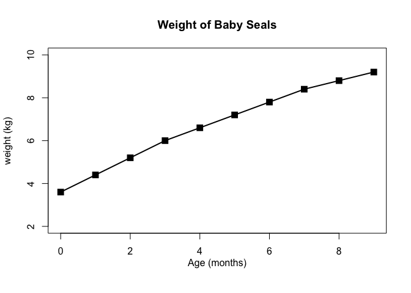
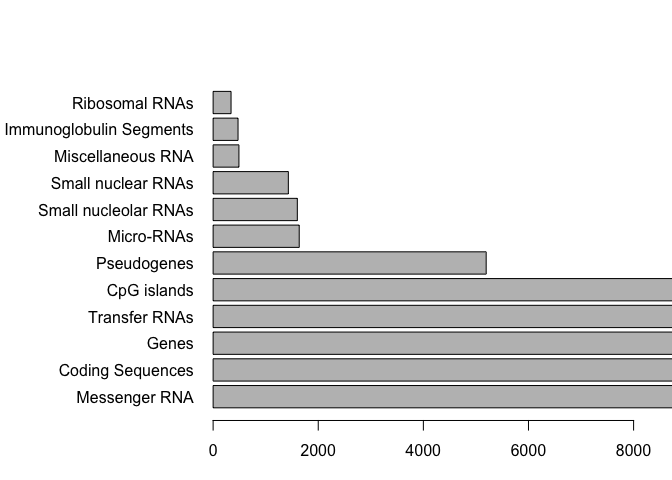
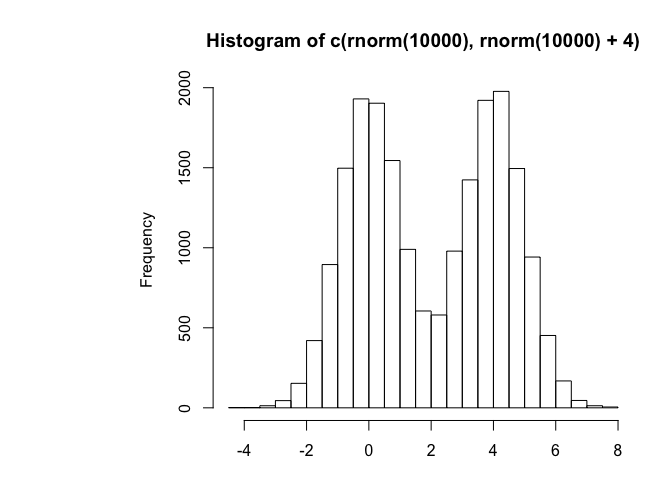
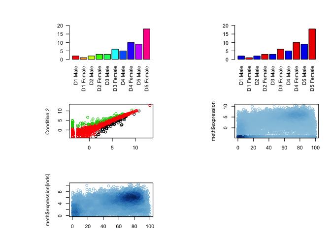

class05
================

``` r
weight <- read.table("bimm143_05_rstats/weight_chart.txt", header=T)
## line and dot plot below
plot(weight, typ="o",pch=15, cex=1.5, lwd=2, ylim=c(2,10), xlab="Age (months)
     ", ylab = "weight (kg)", main = "Weight of Baby Seals")
```



``` r
counts <- read.table("bimm143_05_rstats/feature_counts.txt", header = T, sep="\t")

## how to change margins on sides of graph (bottom, left, top, right)
    par(mar=c(3.1, 11.1, 4.1, 2))

barplot(counts$Count, horiz = TRUE, names.arg = counts$Feature, las=1, xlim = c(0,8000))
```



``` r
hist(c(rnorm(10000),rnorm(10000)+4), breaks=30)
```



``` r
## to have multiple plots shown in one image
  par(mfrow=c(3,2))
  
## 3A 
   male_female <- read.table("bimm143_05_rstats/male_female_counts.txt", header = T, sep="\t")
  
## rainbow colors below 
barplot(male_female$Count, names.arg = male_female$Sample, las=2, ylim = c(0, 20),
        col=c(rainbow(nrow(male_female))))
  
 ## alternate colors below
  barplot(male_female$Count, col=c("blue2","red2"), names.arg = male_female$Sample, las=2, ylim = c(0, 20))

## 3B
genes <- read.table("bimm143_05_rstats/up_down_expression.txt", header = T, sep="\t")

nrow(genes)       
```

    ## [1] 5196

``` r
 ## 5200 genes
table(genes$State)
```

    ## 
    ##       down unchanging         up 
    ##         72       4997        127

``` r
 ## shows how many of each state 
  
plot(genes$Condition1, genes$Condition2, col=genes$State, ylab="Condition 2", xlab="Condition 1")
##  scatter plot with color based on condition of up, down, or uncahnged


palette(c("blue", "grey", "red"))
 ## to change colors 
 ## just do palette() to check 
  

## 3C
## read.delim() does same thing as read.table with header=T and sep="\t"
meth <- read.delim("bimm143_05_rstats/expression_methylation.txt")

mycols <- densCols(meth$gene.meth, meth$expression)

plot(meth$gene.meth, meth$expression, col=mycols)


inds <- meth$expression >0
mycols2 <- densCols(meth$gene.meth[inds], meth$expression[inds])
plot(meth$gene.meth[inds], meth$expression[inds], col=mycols2)
 ##   this makes it only plot points greater than 0
```


