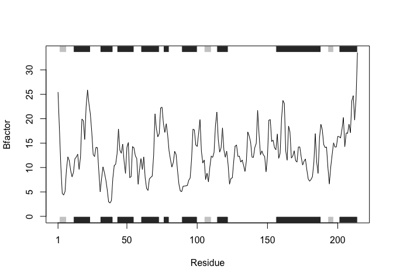

class06
================

``` r
#new function
add <- function(x, y=1) {
  x+y
}


rescale <- function(x) {
  rng <-range(x, na.rm=T)
  #put na.rm=t so that NAs dont make no data return
  (x - rng[1]) / (rng[2] - rng[1])
}
rescale(1:10)
```

    ##  [1] 0.0000000 0.1111111 0.2222222 0.3333333 0.4444444 0.5555556 0.6666667
    ##  [8] 0.7777778 0.8888889 1.0000000

``` r
rescale <- function(x) {
  rng <-range(x, na.rm=T)
 answer <- (x - rng[1]) / (rng[2] - rng[1])
 
 plot(answer, type = "o")
}
rescale(1:20)
```


``` r
rescale <- function(x, na.rm=TRUE, plot=FALSE) {
  if(na.rm) {
    rng <-range(x, na.rm=TRUE)
  } else {
    rng <-range(x)
  }
  print("Hello")
  answer <- (x - rng[1]) / (rng[2] - rng[1])
 # return(answer) this needs to be at the end -- stops at return
  print("is it me you are looking for?")
  if(plot) {
    plot(answer, typ="b", lwd=4)
  }
  print("I can see it in ...") #can only get a plot if you add plot=t in recall
  return(answer)
}
rescale(1:10, plot=T)
```

    ## [1] "Hello"
    ## [1] "is it me you are looking for?"

    ## [1] "I can see it in ..."

    ##  [1] 0.0000000 0.1111111 0.2222222 0.3333333 0.4444444 0.5555556 0.6666667
    ##  [8] 0.7777778 0.8888889 1.0000000

``` r
# install.packages("bio3d")

library("bio3d")
```


``` r
s1 <- read.pdb("4AKE")  # kinase with drug
```

    ##   Note: Accessing on-line PDB file

``` r
s2 <- read.pdb("1AKE")  # kinase no drug
```

    ##   Note: Accessing on-line PDB file
    ##    PDB has ALT records, taking A only, rm.alt=TRUE

``` r
s3 <- read.pdb("1E4Y")  # kinase with drug
```

    ##   Note: Accessing on-line PDB file

``` r
s1.chainA <- trim.pdb(s1, chain="A", elety="CA")
s2.chainA <- trim.pdb(s2, chain="A", elety="CA")
s3.chainA <- trim.pdb(s3, chain="A", elety="CA")
s1.b <- s1.chainA$atom$b
s2.b <- s2.chainA$atom$b
s3.b <- s3.chainA$atom$b
#plotb1(s1.b, sse=s1.chainA, typ="l", ylab="Bfactor")
#plotb2(s2.b, sse=s2.chainA, typ="l", ylab="Bfactor")
plotb3(s3.b, sse=s3.chainA, typ="l", ylab="Bfactor")
```



``` r
##compressed code is below

x<-"4AKE"
s <- read.pdb(x)
```

    ##   Note: Accessing on-line PDB file

    ## Warning in get.pdb(file, path = tempdir(), verbose = FALSE): /var/folders/
    ## rr/_6x1kz1109v403h1lxy5kr1r0000gn/T//RtmpOVIMEi/4AKE.pdb exists. Skipping
    ## download

``` r
chainA <- trim.pdb(s, chain = "A", elety = "CA")
b <- chainA$atom$b
plotb3(b, sse=chainA, typ="l", ylab="Bfactor")

#show multiple on same graph
points(s2.b, typ="l", col = "blue")
```


``` r
## make work for anything

pdb <- function(x) {
s <- read.pdb(x)
#to get just the A chain of the protein
chainA <- trim.pdb(s, chain = "A", elety = "CA")
#to get the B unit of the A chain
b <- chainA$atom$b
#to plot the amount of B factor against residue to show frequency
plotb3(b, sse=chainA, typ="l", ylab="Bfactor")
}
#the output of the function is the plot for the specific protein that is put into the pdb function

#sample run
pdb("4AKE")
```

    ##   Note: Accessing on-line PDB file

    ## Warning in get.pdb(file, path = tempdir(), verbose = FALSE): /var/folders/
    ## rr/_6x1kz1109v403h1lxy5kr1r0000gn/T//RtmpOVIMEi/4AKE.pdb exists. Skipping
    ## download


