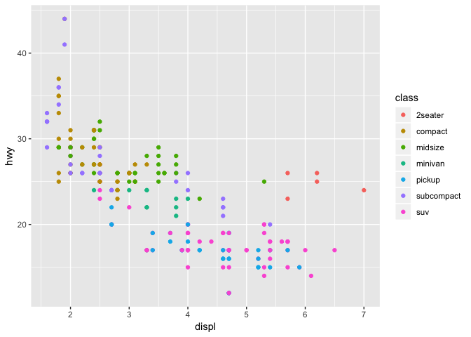

class07
================

``` r
#going back on how to make functions
#this below is sourcing our old envirnment

source("http://tinyurl.com/rescale-R")

# rescale() would give an error 
# rescale2() would give custom error message at stop()

#to find which inputs have Both NA as values -- 
#start with simple string we know answer to

x <- c(1, 2, NA, 3, NA)
y <- c(NA, 3, NA, 3, 4)

is.na(x)
```

    ## [1] FALSE FALSE  TRUE FALSE  TRUE

``` r
#gives true=NA for x vector

# how to combine for if BOTH are
is.na(x) & is.na(y)
```

    ## [1] FALSE FALSE  TRUE FALSE FALSE

``` r
# how to count how many true
sum(is.na(x) & is.na(y))
```

    ## [1] 1

``` r
# to make into function
both_na <- function(x,y) {
  sum(is.na(x) & is.na(y))
}

#test it
x <- c(NA, NA, NA)
y1 <- c(1, NA, NA)
y2 <- c(1, NA, NA, NA)

# both_na(x, y2) #wont work bc diff length

#to make sure same length and dont loop
both_na2 <- function(x, y) {
  if(length(x) != length(y)) {
    stop("Input x and y should be vectors of the same length", call.=FALSE)
  }
  sum( is.na(x) & is.na(y) )
}

# both_na2(x, y2) #gives custom  error

both_na3 <- function(x, y) {
  ## Print some info on where NA's are as well as the number of them 
  if(length(x) != length(y)) {
    stop("Input x and y should be vectors of the same length", call.=FALSE)
  }
  na.in.both <- ( is.na(x) & is.na(y) )
  na.number  <- sum(na.in.both) #gives amount of both NAs
  na.which   <- which(na.in.both) #tells which position these are at
  
  message("Found ", na.number, " NA's at position(s):", 
          paste(na.which, collapse=", ") ) 
  
  return( list(number=na.number, which=na.which) )
}

# df1 and df2 have different amount of info and order
#want to simplify and find intersect of tables

x <- df1$IDs
y <- df2$IDs

intersect(x,y)
```

    ## [1] "gene2" "gene3"

``` r
#this shows which is in both, but doesnt give any info
#look at 'see also' in help page for intersect
x %in% y
```

    ## [1] FALSE  TRUE  TRUE

``` r
#this tells what position in x is the similar ones
inds <- x %in% y
x[inds]
```

    ## [1] "gene2" "gene3"

``` r
x[x %in% y]
```

    ## [1] "gene2" "gene3"

``` r
y[y %in% x]
```

    ## [1] "gene2" "gene3"

``` r
#need to show exp aswell
df1[df1$IDs %in% df2$IDs,]
```

    ##     IDs exp
    ## 2 gene2   1
    ## 3 gene3   1

``` r
df2[df2$IDs %in% df1$IDs,]
```

    ##     IDs exp
    ## 1 gene2  -2
    ## 3 gene3   1

``` r
gene_intersect <- function(x, y) { cbind(x[x%in%y],y[y%in%x])
}

gene_intersect2 <- function(df1, df2) {
  cbind( df1[ df1$IDs %in% df2$IDs, ],
         df2[ df2$IDs %in% df1$IDs, "exp"])
}

# GG PLOT
# install.packages("ggplot2")
library("ggplot2")

    #in aes( x axis, y axis, colour by third variable)
ggplot(mpg, aes(displ, hwy, colour = class)) + geom_point()
```


