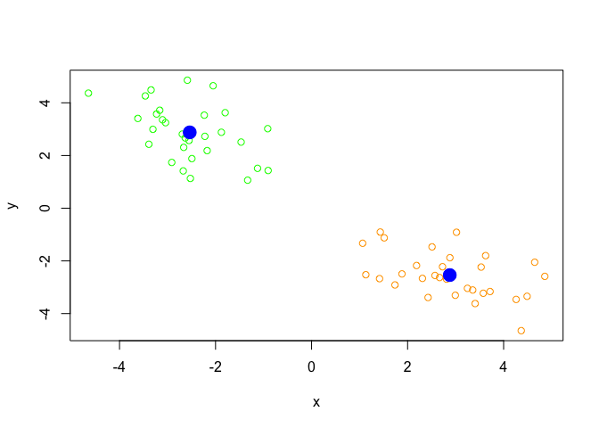
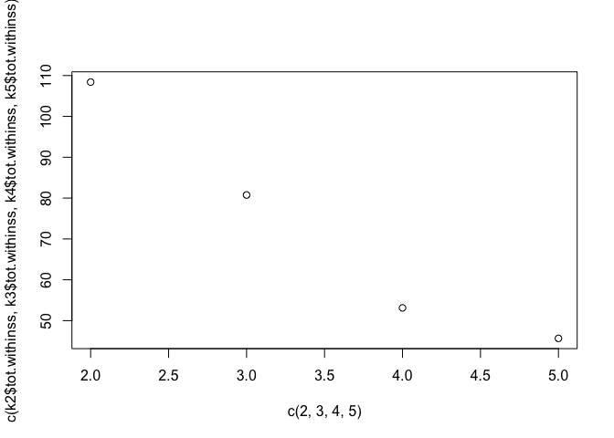
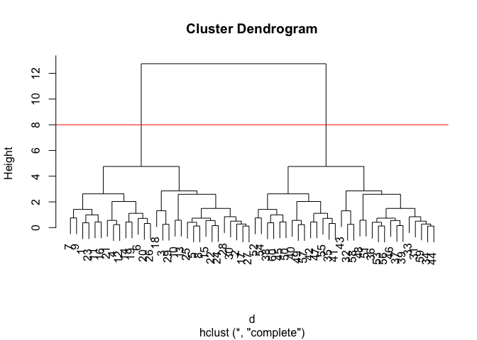
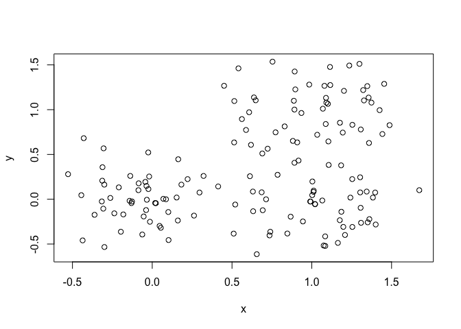
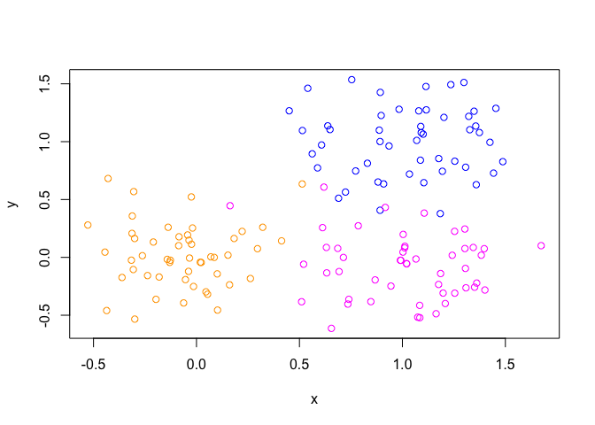
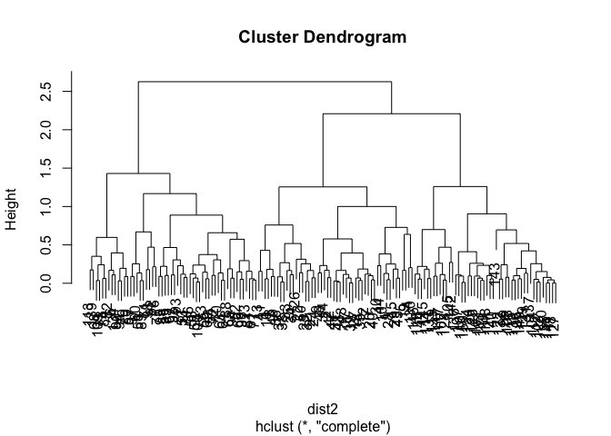
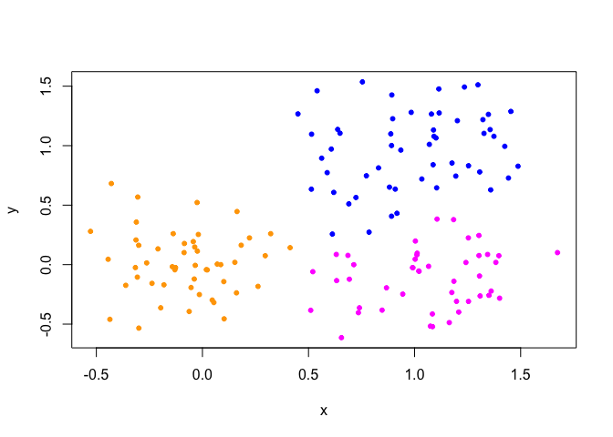
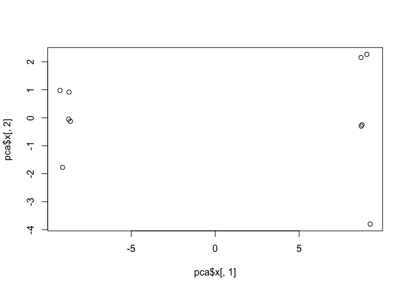
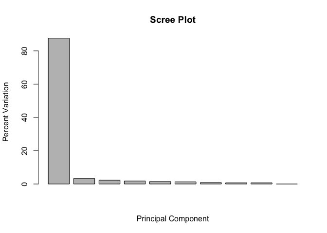
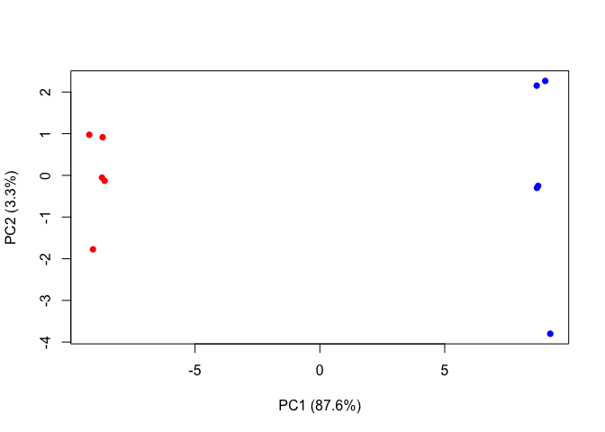

class08
================
Tori Ondo
10/25/2018

K-means Clustering
------------------

Our first example with **kmeans()** function

``` r
tmp <- c(rnorm(30,-3), rnorm(30,3))
x <- cbind(x=tmp, y=rev(tmp))

k <- kmeans(x, centers = 2, nstart =20)
k
```

    ## K-means clustering with 2 clusters of sizes 30, 30
    ## 
    ## Cluster means:
    ##           x         y
    ## 1  2.878438 -2.537712
    ## 2 -2.537712  2.878438
    ## 
    ## Clustering vector:
    ##  [1] 2 2 2 2 2 2 2 2 2 2 2 2 2 2 2 2 2 2 2 2 2 2 2 2 2 2 2 2 2 2 1 1 1 1 1
    ## [36] 1 1 1 1 1 1 1 1 1 1 1 1 1 1 1 1 1 1 1 1 1 1 1 1 1
    ## 
    ## Within cluster sum of squares by cluster:
    ## [1] 54.19985 54.19985
    ##  (between_SS / total_SS =  89.0 %)
    ## 
    ## Available components:
    ## 
    ## [1] "cluster"      "centers"      "totss"        "withinss"    
    ## [5] "tot.withinss" "betweenss"    "size"         "iter"        
    ## [9] "ifault"

Q. How many points are in each cluster? there are 30 points in each cluster Q. What ‘component’ of your result object details - cluster size?: k*s**i**z**e* − *c**l**u**s**t**e**r**a**s**s**i**g**n**m**e**n**t*/*m**e**m**b**e**r**s**h**i**p*?:*k*cluster - cluster center?: k$centers

``` r
k$size
```

    ## [1] 30 30

``` r
k$cluster
```

    ##  [1] 2 2 2 2 2 2 2 2 2 2 2 2 2 2 2 2 2 2 2 2 2 2 2 2 2 2 2 2 2 2 1 1 1 1 1
    ## [36] 1 1 1 1 1 1 1 1 1 1 1 1 1 1 1 1 1 1 1 1 1 1 1 1 1

``` r
k$centers
```

    ##           x         y
    ## 1  2.878438 -2.537712
    ## 2 -2.537712  2.878438

Plot x colored by the kmeans cluster assignment and add cluster centers as blue points

``` r
palette(c("orange", "green"))
plot(x, col=k$cluster)
points(k$centers, col="blue", pch = 20, cex = 3)
```



Q. Repeat for k=3, which has the lower tot.withinss?

``` r
k2 <- kmeans(x, centers = 2, nstart =20)
k3 <- kmeans(x, centers = 3, nstart =20)
k4 <- kmeans(x, centers = 4, nstart =20)
k5 <- kmeans(x, centers = 5, nstart =20)

k2$tot.withinss
```

    ## [1] 108.3997

``` r
k3$tot.withinss
```

    ## [1] 80.76126

``` r
k4$tot.withinss
```

    ## [1] 53.12282

``` r
k5$tot.withinss
```

    ## [1] 45.65371

``` r
plot(c(2, 3, 4,5), c(k2$tot.withinss,k3$tot.withinss, k4$tot.withinss, k5$tot.withinss))
```



Hierarchical Clustering
-----------------------

Trying \*\*hclust()\* function. This needs a distance matrix as input!

``` r
d <- dist(x)
hc <- hclust(d)
plot(hc)

#draw a line
abline(h=8, col="red")
```



``` r
#cut by height
cutree(hc, h=8)
```

    ##  [1] 1 1 1 1 1 1 1 1 1 1 1 1 1 1 1 1 1 1 1 1 1 1 1 1 1 1 1 1 1 1 2 2 2 2 2
    ## [36] 2 2 2 2 2 2 2 2 2 2 2 2 2 2 2 2 2 2 2 2 2 2 2 2 2

### A more 'real' example

Step 1. Generate some example data for clustering

``` r
# Step 1. Generate some example data for clustering
x <- rbind(
  matrix(rnorm(100, mean=0, sd = 0.3), ncol = 2),   # c1
  matrix(rnorm(100, mean = 1, sd = 0.3), ncol = 2), # c2
  matrix(c(rnorm(50, mean = 1, sd = 0.3),           # c3
           rnorm(50, mean = 0, sd = 0.3)), ncol = 2))
colnames(x) <- c("x", "y")
# Step 2. Plot the data without clustering
plot(x)
```



``` r
# Step 3. Generate colors for known clusters
#         (just so we can compare to hclust results)
palette(c("orange", "blue", "magenta"))
col <- as.factor( rep(c("c1","c2","c3"), each=50) )
plot(x, col=col)
```



``` r
# Q. Use the dist(), hclust(), plot() and cutree() functions to return 2 and 3 clusters
dist2 <- dist(x)
hc3 <- hclust(dist2)
plot(hc3)
```



``` r
grp.3 <- cutree(hc3, k=3)
plot(x, col=grp.3, pch=20)
```



``` r
# Q. How does this compare to your known 'col' groups?
#use the table() function !!

table(cutree(hc3, k=3))
```

    ## 
    ##  1  2  3 
    ## 50 54 46

``` r
table(col)
```

    ## col
    ## c1 c2 c3 
    ## 50 50 50

``` r
#this shows that col splits it into 3 even groups of 50 while hclust split it into groups of 59, 49, and 42
```

PCA
---

``` r
# Initialize a blank 100 row by 10 column matrix
mydata <- matrix(nrow=100, ncol=10)

# Lets label the rows gene1, gene2 etc. to gene100
rownames(mydata) <- paste("gene", 1:100, sep="")

# Lets label the first 5 columns wt1, wt2, wt3, wt4 and wt5
#   and the last 5 ko1, ko2 etc. to ko5 (for "knock-out")
colnames(mydata) <- c( paste("wt", 1:5, sep=""),
                       paste("ko", 1:5, sep="") )

# Fill in some fake read counts
for(i in 1:nrow(mydata)) {
wt.values <- rpois(5, lambda=sample(x=10:1000, size=1)) 
ko.values <- rpois(5, lambda=sample(x=10:1000, size=1))
mydata[i,] <- c(wt.values, ko.values)
}
head(mydata)
```

    ##       wt1 wt2 wt3 wt4 wt5 ko1 ko2 ko3 ko4 ko5
    ## gene1 269 322 292 299 288 717 722 732 665 721
    ## gene2 382 400 410 428 411 582 557 589 578 539
    ## gene3 430 451 447 462 469 585 590 608 583 623
    ## gene4 366 368 361 372 365 153 153 157 123 140
    ## gene5 889 860 909 927 909 839 886 860 817 837
    ## gene6 247 284 280 264 227 154 168 152 160 130

``` r
## lets do PCA - need to use "t" becuase samples should be rows
pca <- prcomp(t(mydata), scale=TRUE)
 
attributes(pca)
```

    ## $names
    ## [1] "sdev"     "rotation" "center"   "scale"    "x"       
    ## 
    ## $class
    ## [1] "prcomp"

``` r
# A basic PC1 vs PC2 2-D plot -- use name$x to plot
plot(pca$x[,1], pca$x[,2])
```



How much variance from original data is captured?

``` r
# Variance captured per PC
pca.var <- pca$sdev^2
pca.var.per <- round(pca.var/sum(pca.var)*100, 1)

pca.var.per
```

    ##  [1] 87.6  3.3  2.3  1.8  1.5  1.3  0.9  0.7  0.7  0.0

``` r
#Make a scree plot!
barplot(pca.var.per, main="Scree Plot",
        xlab="Principal Component", ylab="Percent Variation")
```



Lets make our PC plot more helpful

``` r
# A vector of colors for wt and ko samples
colvec <- colnames(mydata)
colvec[grep("wt", colvec)] <- "red"
colvec[grep("ko", colvec)] <- "blue"
plot(pca$x[,1], pca$x[,2], col=colvec, pch=16,
     xlab=paste0("PC1 (", pca.var.per[1], "%)"),
     ylab=paste0("PC2 (", pca.var.per[2], "%)"))
```



identify(pca*x*\[,1\],*p**c**a*x\[,2\], labels=colnames(mydata)) this would let you add labels to individual points on the graph within the console

``` r
# Lets focus on PC1 as it accounts for > 90% of variance
loading_scores <- pca$rotation[,1]
summary(loading_scores)
```

    ##     Min.  1st Qu.   Median     Mean  3rd Qu.     Max. 
    ## -0.10674 -0.10498  0.08948  0.01624  0.10608  0.10680

``` r
gene_scores <- abs(loading_scores)
# Sort by magnitudes from high to low
gene_score_ranked <- sort(gene_scores, decreasing=TRUE)
## Find the names of the top 5 genes
top_5_genes <- names(gene_score_ranked[1:5])

## Show the scores (with +/- sign)
pca$rotation[top_5_genes,1]
```

    ##     gene44     gene10     gene99     gene73     gene85 
    ##  0.1068038  0.1067955  0.1067878  0.1067490 -0.1067443

Class Worksheet
---------------
