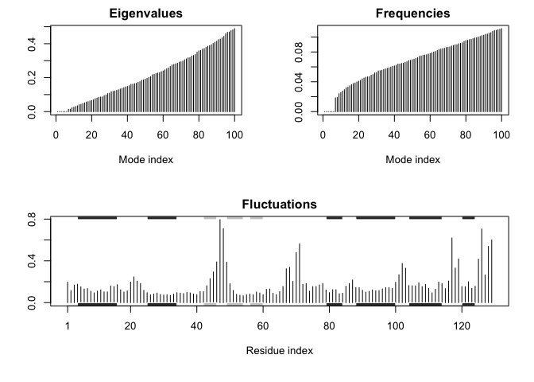

class13
================

work with structure 1HSG

``` r
library(bio3d) 
file.name <- get.pdb("1hsg")
```

    ## Warning in get.pdb("1hsg"): ./1hsg.pdb exists. Skipping download

Read this into R and examine composition

``` r
hiv <- read.pdb(file.name)
hiv
```

    ## 
    ##  Call:  read.pdb(file = file.name)
    ## 
    ##    Total Models#: 1
    ##      Total Atoms#: 1686,  XYZs#: 5058  Chains#: 2  (values: A B)
    ## 
    ##      Protein Atoms#: 1514  (residues/Calpha atoms#: 198)
    ##      Nucleic acid Atoms#: 0  (residues/phosphate atoms#: 0)
    ## 
    ##      Non-protein/nucleic Atoms#: 172  (residues: 128)
    ##      Non-protein/nucleic resid values: [ HOH (127), MK1 (1) ]
    ## 
    ##    Protein sequence:
    ##       PQITLWQRPLVTIKIGGQLKEALLDTGADDTVLEEMSLPGRWKPKMIGGIGGFIKVRQYD
    ##       QILIEICGHKAIGTVLVGPTPVNIIGRNLLTQIGCTLNFPQITLWQRPLVTIKIGGQLKE
    ##       ALLDTGADDTVLEEMSLPGRWKPKMIGGIGGFIKVRQYDQILIEICGHKAIGTVLVGPTP
    ##       VNIIGRNLLTQIGCTLNF
    ## 
    ## + attr: atom, xyz, seqres, helix, sheet,
    ##         calpha, remark, call

Q1: What is the name of the two non protein resid values in this structure? ~HOH and MK1 What does resid correspond to and how would you get a listing of all reside values in this structure?

Split into protein and ligand files
-----------------------------------

we will use the 'trim.pdb()' function to split our structure

``` r
prot <- trim.pdb(hiv, "protein")
lig  <- trim.pdb(hiv, "ligand")

#now write these into their own pdb file
write.pdb(prot, file="1hsg_protein.pdb")
write.pdb(lig, file="1hsg_ligand.pdb")
```

Docking with Vina
-----------------

we ran this in terminal: ~/Downloads/autodock\_vina\_1\_1\_2\_mac/bin/vina --config config.txt --log log.txt

Read docking results
--------------------

we got a file all.pdbqt that we need to make into a PDB format

``` r
res <- read.pdb("all.pdbqt", multi=TRUE)

write.pdb(res, "results.pdb")
```

``` r
ori <- read.pdb("1hsg_ligand.pdbqt")
rmsd(ori, res)
```

    ##  [1]  0.590 11.163 10.531  4.364 11.040  3.682  5.741  3.864  5.442 10.920
    ## [11]  4.318  6.249 11.084  8.929

Section 3
---------

Normal Mode Analysis (NMA) Normal mode analysis (NMA) is one of the major simulation techniques used to probe large- scale motions in biomolecules. Typical application is for the prediction of functional motions in proteins. Normal mode analysis (NMA) of a single protein structure can be carried out by providing a PDB object to the function nma(). In the code below we first load the Bio3D package and then download an example structure of hen egg white lysozyme (PDB id 1hel) with the function read.pdb(). Finally the function nma() is used perform the normal mode calculation:

``` r
pdb <- read.pdb("1HEL")
```

    ##   Note: Accessing on-line PDB file

``` r
modes <- nma(pdb) 
```

    ##  Building Hessian...     Done in 0.029 seconds.
    ##  Diagonalizing Hessian...    Done in 0.208 seconds.

``` r
plot(modes, sse=pdb)
```



``` r
# Visualize NMA
mktrj(modes, mode=7, file="nma_7.pdb")
```
