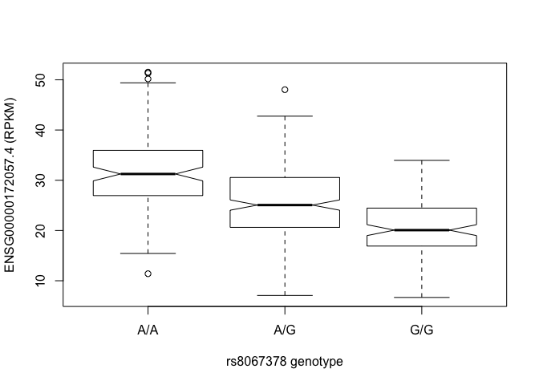
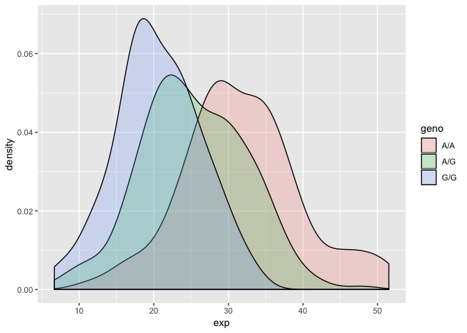

class14
================

Examine Asthma SNPs in MXL (Mexican Ancestry Los Angeles)
---------------------------------------------------------

``` r
data <- read.csv("373531-SampleGenotypes-Homo_sapiens_Variation_Sample_rs8067378.csv")
```

Find amount of each genotype

``` r
gen_count <- table(data$Genotype..forward.strand.)
gen_count
```

    ## 
    ## A|A A|G G|A G|G 
    ##  22  21  12   9

Find Proportions

``` r
genotypes <- round((gen_count/sum(gen_count))*100, 2)
genotypes
```

    ## 
    ##   A|A   A|G   G|A   G|G 
    ## 34.38 32.81 18.75 14.06

There are 34.38 % AA genotypes in this population

Interpreting base qualities in R
--------------------------------

``` r
#install.packages("seqinr")
#install.packages("gtools")
```

``` r
library(seqinr)
library(gtools)
phred <- asc( s2c("DDDDCDEDCDDDDBBDDDCC@")) - 33
phred
```

    ##  D  D  D  D  C  D  E  D  C  D  D  D  D  B  B  D  D  D  C  C  @ 
    ## 35 35 35 35 34 35 36 35 34 35 35 35 35 33 33 35 35 35 34 34 31

``` r
genes <- read.table("https://bioboot.github.io/bimm143_S18/class-material/rs8067378_ENSG00000172057.6.txt")
```

``` r
summary(genes)
```

    ##      sample     geno          exp        
    ##  HG00096:  1   A/A:108   Min.   : 6.675  
    ##  HG00097:  1   A/G:233   1st Qu.:20.004  
    ##  HG00099:  1   G/G:121   Median :25.116  
    ##  HG00100:  1             Mean   :25.640  
    ##  HG00101:  1             3rd Qu.:30.779  
    ##  HG00102:  1             Max.   :51.518  
    ##  (Other):456

``` r
inds.ag <- genes$geno == "A/G"
summary( genes$exp[inds.ag] )
```

    ##    Min. 1st Qu.  Median    Mean 3rd Qu.    Max. 
    ##   7.075  20.626  25.065  25.397  30.552  48.034

``` r
inds.ag <- genes$geno == "A/A"
summary( genes$exp[inds.ag] )
```

    ##    Min. 1st Qu.  Median    Mean 3rd Qu.    Max. 
    ##   11.40   27.02   31.25   31.82   35.92   51.52

``` r
inds.ag <- genes$geno == "G/G"
summary( genes$exp[inds.ag] )
```

    ##    Min. 1st Qu.  Median    Mean 3rd Qu.    Max. 
    ##   6.675  16.903  20.074  20.594  24.457  33.956

``` r
p <- boxplot(exp~geno, data=genes, xlab="rs8067378 genotype", ylab="ENSG00000172057.4 (RPKM)", notch=T)
```



``` r
library(ggplot2)
ggplot(genes, aes(exp, fill = geno)) + geom_density(alpha = 0.2)
```


