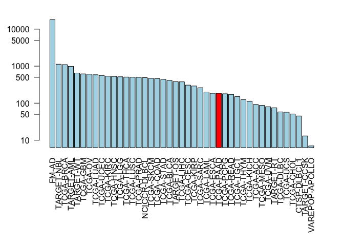
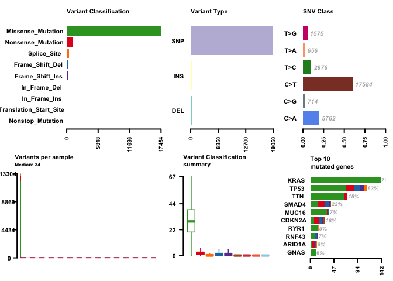
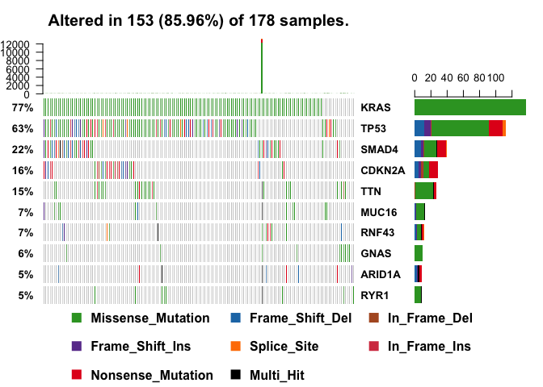
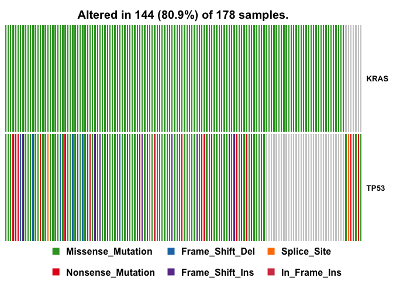
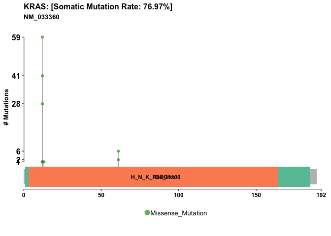

class18
================

``` r
library(GenomicDataCommons)
library(maftools)
```

``` r
GenomicDataCommons::status()
```

    ## $commit
    ## [1] "acaf65369f6cea8337c6b59f0888761c9ed34654"
    ## 
    ## $data_release
    ## [1] "Data Release 13.0 - September 27, 2018"
    ## 
    ## $status
    ## [1] "OK"
    ## 
    ## $tag
    ## [1] "1.17.1"
    ## 
    ## $version
    ## [1] 1

``` r
cases_by_project <- cases() %>%
  facet("project.project_id") %>%
  aggregations()
head(cases_by_project)
```

    ## $project.project_id
    ##               key doc_count
    ## 1           FM-AD     18004
    ## 2      TARGET-NBL      1127
    ## 3       TCGA-BRCA      1098
    ## 4      TARGET-AML       988
    ## 5       TARGET-WT       652
    ## 6        TCGA-GBM       617
    ## 7         TCGA-OV       608
    ## 8       TCGA-LUAD       585
    ## 9       TCGA-UCEC       560
    ## 10      TCGA-KIRC       537
    ## 11      TCGA-HNSC       528
    ## 12       TCGA-LGG       516
    ## 13      TCGA-THCA       507
    ## 14      TCGA-LUSC       504
    ## 15      TCGA-PRAD       500
    ## 16   NCICCR-DLBCL       489
    ## 17      TCGA-SKCM       470
    ## 18      TCGA-COAD       461
    ## 19      TCGA-STAD       443
    ## 20      TCGA-BLCA       412
    ## 21      TARGET-OS       381
    ## 22      TCGA-LIHC       377
    ## 23      TCGA-CESC       307
    ## 24      TCGA-KIRP       291
    ## 25      TCGA-SARC       261
    ## 26      TCGA-LAML       200
    ## 27      TCGA-ESCA       185
    ## 28      TCGA-PAAD       185
    ## 29      TCGA-PCPG       179
    ## 30      TCGA-READ       172
    ## 31      TCGA-TGCT       150
    ## 32      TCGA-THYM       124
    ## 33      TCGA-KICH       113
    ## 34       TCGA-ACC        92
    ## 35      TCGA-MESO        87
    ## 36       TCGA-UVM        80
    ## 37      TARGET-RT        75
    ## 38      TCGA-DLBC        58
    ## 39       TCGA-UCS        57
    ## 40      TCGA-CHOL        51
    ## 41    CTSP-DLBCL1        45
    ## 42    TARGET-CCSK        13
    ## 43 VAREPOP-APOLLO         7

``` r
x <- cases_by_project$project.project_id

# Make a custom color vector for our plot
colvec <- rep("lightblue", nrow(x))
colvec[x$key=="TCGA-PAAD"] <- "red"

# Plot with 'log' for y axis and rotate labels with 'las'
par(mar=c(10, 4, 2, 2))
barplot(x$doc_count, names.arg=x$key, log="y", col=colvec, las=2)
```



``` r
## This code snipet is taken from the package vignette
file_records <- files() %>%
  filter(~ cases.project.project_id == "TCGA-PAAD" &
    data_type == "Gene Expression Quantification" &
    analysis.workflow_type == "HTSeq - Counts") %>%
  response_all()
```

``` r
head(file_records)
```

    ## $results
    ##                          data_type                 updated_datetime
    ## 1   Gene Expression Quantification 2018-09-11T22:53:33.639292+00:00
    ## 2   Gene Expression Quantification 2018-09-11T22:53:33.639292+00:00
    ## 3   Gene Expression Quantification 2018-09-11T22:53:33.639292+00:00
    ## 4   Gene Expression Quantification 2018-09-11T22:53:33.639292+00:00
    ## 5   Gene Expression Quantification 2018-09-11T22:53:33.639292+00:00
    ## 6   Gene Expression Quantification 2018-09-11T22:53:33.639292+00:00
    ## 7   Gene Expression Quantification 2018-09-11T22:53:33.639292+00:00
    ## 8   Gene Expression Quantification 2018-09-11T22:53:33.639292+00:00
    ## 9   Gene Expression Quantification 2018-09-11T22:53:33.639292+00:00
    ## 10  Gene Expression Quantification 2018-09-11T22:53:33.639292+00:00
    ## 11  Gene Expression Quantification 2018-09-11T22:53:33.639292+00:00
    ## 12  Gene Expression Quantification 2018-09-11T22:53:33.639292+00:00
    ## 13  Gene Expression Quantification 2018-09-11T22:53:33.639292+00:00
    ## 14  Gene Expression Quantification 2018-09-11T22:53:33.639292+00:00
    ## 15  Gene Expression Quantification 2018-09-11T22:53:33.639292+00:00
    ## 16  Gene Expression Quantification 2018-09-11T22:53:33.639292+00:00
    ## 17  Gene Expression Quantification 2018-09-11T22:53:33.639292+00:00
    ## 18  Gene Expression Quantification 2018-09-11T22:53:33.639292+00:00
    ## 19  Gene Expression Quantification 2018-09-11T22:53:33.639292+00:00
    ## 20  Gene Expression Quantification 2018-09-11T22:53:33.639292+00:00
    ## 21  Gene Expression Quantification 2018-09-11T22:53:33.639292+00:00
    ## 22  Gene Expression Quantification 2018-09-11T22:53:33.639292+00:00
    ## 23  Gene Expression Quantification 2018-09-11T22:53:33.639292+00:00
    ## 24  Gene Expression Quantification 2018-09-11T22:53:33.639292+00:00
    ## 25  Gene Expression Quantification 2018-09-11T22:53:33.639292+00:00
    ## 26  Gene Expression Quantification 2018-09-11T22:53:33.639292+00:00
    ## 27  Gene Expression Quantification 2018-09-11T22:53:33.639292+00:00
    ## 28  Gene Expression Quantification 2018-09-11T22:53:33.639292+00:00
    ## 29  Gene Expression Quantification 2018-09-11T22:53:33.639292+00:00
    ## 30  Gene Expression Quantification 2018-09-11T22:53:33.639292+00:00
    ## 31  Gene Expression Quantification 2018-09-11T22:53:33.639292+00:00
    ## 32  Gene Expression Quantification 2018-09-11T22:53:33.639292+00:00
    ## 33  Gene Expression Quantification 2018-09-11T22:53:33.639292+00:00
    ## 34  Gene Expression Quantification 2018-09-11T22:53:33.639292+00:00
    ## 35  Gene Expression Quantification 2018-09-11T22:53:33.639292+00:00
    ## 36  Gene Expression Quantification 2018-09-11T22:53:33.639292+00:00
    ## 37  Gene Expression Quantification 2018-09-11T22:53:33.639292+00:00
    ## 38  Gene Expression Quantification 2018-09-11T22:53:33.639292+00:00
    ## 39  Gene Expression Quantification 2018-09-11T22:53:33.639292+00:00
    ## 40  Gene Expression Quantification 2018-09-11T22:53:33.639292+00:00
    ## 41  Gene Expression Quantification 2018-09-11T22:53:33.639292+00:00
    ## 42  Gene Expression Quantification 2018-09-11T22:53:33.639292+00:00
    ## 43  Gene Expression Quantification 2018-09-11T22:53:33.639292+00:00
    ## 44  Gene Expression Quantification 2018-09-11T22:53:33.639292+00:00
    ## 45  Gene Expression Quantification 2018-09-11T22:53:33.639292+00:00
    ## 46  Gene Expression Quantification 2018-09-11T22:53:33.639292+00:00
    ## 47  Gene Expression Quantification 2018-09-11T22:53:33.639292+00:00
    ## 48  Gene Expression Quantification 2018-09-11T22:53:33.639292+00:00
    ## 49  Gene Expression Quantification 2018-09-11T22:53:33.639292+00:00
    ## 50  Gene Expression Quantification 2018-09-11T22:53:33.639292+00:00
    ## 51  Gene Expression Quantification 2018-09-11T22:53:33.639292+00:00
    ## 52  Gene Expression Quantification 2018-09-11T22:53:33.639292+00:00
    ## 53  Gene Expression Quantification 2018-09-11T22:53:33.639292+00:00
    ## 54  Gene Expression Quantification 2018-09-11T22:53:33.639292+00:00
    ## 55  Gene Expression Quantification 2018-09-11T22:53:33.639292+00:00
    ## 56  Gene Expression Quantification 2018-09-11T22:53:33.639292+00:00
    ## 57  Gene Expression Quantification 2018-09-11T22:53:33.639292+00:00
    ## 58  Gene Expression Quantification 2018-09-11T22:53:33.639292+00:00
    ## 59  Gene Expression Quantification 2018-09-11T22:53:33.639292+00:00
    ## 60  Gene Expression Quantification 2018-09-11T22:53:33.639292+00:00
    ## 61  Gene Expression Quantification 2018-09-11T22:53:33.639292+00:00
    ## 62  Gene Expression Quantification 2018-09-11T22:53:33.639292+00:00
    ## 63  Gene Expression Quantification 2018-09-11T22:53:33.639292+00:00
    ## 64  Gene Expression Quantification 2018-09-11T22:53:33.639292+00:00
    ## 65  Gene Expression Quantification 2018-09-11T22:53:33.639292+00:00
    ## 66  Gene Expression Quantification 2018-09-11T22:53:33.639292+00:00
    ## 67  Gene Expression Quantification 2018-09-11T22:53:33.639292+00:00
    ## 68  Gene Expression Quantification 2018-09-11T22:53:33.639292+00:00
    ## 69  Gene Expression Quantification 2018-09-11T22:53:33.639292+00:00
    ## 70  Gene Expression Quantification 2018-09-11T22:53:33.639292+00:00
    ## 71  Gene Expression Quantification 2018-09-11T22:53:33.639292+00:00
    ## 72  Gene Expression Quantification 2018-09-11T22:53:33.639292+00:00
    ## 73  Gene Expression Quantification 2018-09-11T22:53:33.639292+00:00
    ## 74  Gene Expression Quantification 2018-09-11T22:53:33.639292+00:00
    ## 75  Gene Expression Quantification 2018-09-11T22:53:33.639292+00:00
    ## 76  Gene Expression Quantification 2018-09-11T22:53:33.639292+00:00
    ## 77  Gene Expression Quantification 2018-09-11T22:53:33.639292+00:00
    ## 78  Gene Expression Quantification 2018-09-11T22:53:33.639292+00:00
    ## 79  Gene Expression Quantification 2018-09-11T22:53:33.639292+00:00
    ## 80  Gene Expression Quantification 2018-09-11T22:53:33.639292+00:00
    ## 81  Gene Expression Quantification 2018-09-11T22:53:33.639292+00:00
    ## 82  Gene Expression Quantification 2018-09-11T22:53:33.639292+00:00
    ## 83  Gene Expression Quantification 2018-09-11T22:53:33.639292+00:00
    ## 84  Gene Expression Quantification 2018-09-11T22:53:33.639292+00:00
    ## 85  Gene Expression Quantification 2018-09-11T22:53:33.639292+00:00
    ## 86  Gene Expression Quantification 2018-09-11T22:53:33.639292+00:00
    ## 87  Gene Expression Quantification 2018-09-11T22:53:33.639292+00:00
    ## 88  Gene Expression Quantification 2018-09-11T22:53:33.639292+00:00
    ## 89  Gene Expression Quantification 2018-09-11T22:53:33.639292+00:00
    ## 90  Gene Expression Quantification 2018-09-11T22:53:33.639292+00:00
    ## 91  Gene Expression Quantification 2018-09-11T22:53:33.639292+00:00
    ## 92  Gene Expression Quantification 2018-09-11T22:53:33.639292+00:00
    ## 93  Gene Expression Quantification 2018-09-11T22:53:33.639292+00:00
    ## 94  Gene Expression Quantification 2018-09-11T22:53:33.639292+00:00
    ## 95  Gene Expression Quantification 2018-09-11T22:53:33.639292+00:00
    ## 96  Gene Expression Quantification 2018-09-11T22:53:33.639292+00:00
    ## 97  Gene Expression Quantification 2018-09-11T22:53:33.639292+00:00
    ## 98  Gene Expression Quantification 2018-09-11T22:53:33.639292+00:00
    ## 99  Gene Expression Quantification 2018-09-11T22:53:33.639292+00:00
    ## 100 Gene Expression Quantification 2018-09-11T22:53:33.639292+00:00
    ## 101 Gene Expression Quantification 2018-09-11T22:53:33.639292+00:00
    ## 102 Gene Expression Quantification 2018-09-11T22:53:33.639292+00:00
    ## 103 Gene Expression Quantification 2018-09-11T22:53:33.639292+00:00
    ## 104 Gene Expression Quantification 2018-09-11T22:53:33.639292+00:00
    ## 105 Gene Expression Quantification 2018-09-11T22:53:33.639292+00:00
    ## 106 Gene Expression Quantification 2018-09-11T22:53:33.639292+00:00
    ## 107 Gene Expression Quantification 2018-09-11T22:53:33.639292+00:00
    ## 108 Gene Expression Quantification 2018-09-11T22:53:33.639292+00:00
    ## 109 Gene Expression Quantification 2018-09-11T22:53:33.639292+00:00
    ## 110 Gene Expression Quantification 2018-09-11T22:53:33.639292+00:00
    ## 111 Gene Expression Quantification 2018-09-11T22:53:33.639292+00:00
    ## 112 Gene Expression Quantification 2018-09-11T22:53:33.639292+00:00
    ## 113 Gene Expression Quantification 2018-09-11T22:53:33.639292+00:00
    ## 114 Gene Expression Quantification 2018-09-11T22:53:33.639292+00:00
    ## 115 Gene Expression Quantification 2018-09-11T22:53:33.639292+00:00
    ## 116 Gene Expression Quantification 2018-09-11T22:53:33.639292+00:00
    ## 117 Gene Expression Quantification 2018-09-11T22:53:33.639292+00:00
    ## 118 Gene Expression Quantification 2018-09-11T22:53:33.639292+00:00
    ## 119 Gene Expression Quantification 2018-09-11T22:53:33.639292+00:00
    ## 120 Gene Expression Quantification 2018-09-11T22:53:33.639292+00:00
    ## 121 Gene Expression Quantification 2018-09-11T22:53:33.639292+00:00
    ## 122 Gene Expression Quantification 2018-09-11T22:53:33.639292+00:00
    ## 123 Gene Expression Quantification 2018-09-11T22:53:33.639292+00:00
    ## 124 Gene Expression Quantification 2018-09-11T22:53:33.639292+00:00
    ## 125 Gene Expression Quantification 2018-09-11T22:53:33.639292+00:00
    ## 126 Gene Expression Quantification 2018-09-11T22:53:33.639292+00:00
    ## 127 Gene Expression Quantification 2018-09-11T22:53:33.639292+00:00
    ## 128 Gene Expression Quantification 2018-09-11T22:53:33.639292+00:00
    ## 129 Gene Expression Quantification 2018-09-11T22:53:33.639292+00:00
    ## 130 Gene Expression Quantification 2018-09-11T22:53:33.639292+00:00
    ## 131 Gene Expression Quantification 2018-09-11T22:53:33.639292+00:00
    ## 132 Gene Expression Quantification 2018-09-11T22:53:33.639292+00:00
    ## 133 Gene Expression Quantification 2018-09-11T22:53:33.639292+00:00
    ## 134 Gene Expression Quantification 2018-09-11T22:53:33.639292+00:00
    ## 135 Gene Expression Quantification 2018-09-11T22:53:33.639292+00:00
    ## 136 Gene Expression Quantification 2018-09-11T22:53:33.639292+00:00
    ## 137 Gene Expression Quantification 2018-09-11T22:53:33.639292+00:00
    ## 138 Gene Expression Quantification 2018-09-11T22:53:33.639292+00:00
    ## 139 Gene Expression Quantification 2018-09-11T22:53:33.639292+00:00
    ## 140 Gene Expression Quantification 2018-09-11T22:53:33.639292+00:00
    ## 141 Gene Expression Quantification 2018-09-11T22:53:33.639292+00:00
    ## 142 Gene Expression Quantification 2018-09-11T22:53:33.639292+00:00
    ## 143 Gene Expression Quantification 2018-09-11T22:53:33.639292+00:00
    ## 144 Gene Expression Quantification 2018-09-11T22:53:33.639292+00:00
    ## 145 Gene Expression Quantification 2018-09-11T22:53:33.639292+00:00
    ## 146 Gene Expression Quantification 2018-09-11T22:53:33.639292+00:00
    ## 147 Gene Expression Quantification 2018-09-11T22:53:33.639292+00:00
    ## 148 Gene Expression Quantification 2018-09-11T22:53:33.639292+00:00
    ## 149 Gene Expression Quantification 2018-09-11T22:53:33.639292+00:00
    ## 150 Gene Expression Quantification 2018-09-11T22:53:33.639292+00:00
    ## 151 Gene Expression Quantification 2018-09-11T22:53:33.639292+00:00
    ## 152 Gene Expression Quantification 2018-09-11T22:53:33.639292+00:00
    ## 153 Gene Expression Quantification 2018-09-11T22:53:33.639292+00:00
    ## 154 Gene Expression Quantification 2018-09-11T22:53:33.639292+00:00
    ## 155 Gene Expression Quantification 2018-09-11T22:53:33.639292+00:00
    ## 156 Gene Expression Quantification 2018-09-11T22:53:33.639292+00:00
    ## 157 Gene Expression Quantification 2018-09-11T22:53:33.639292+00:00
    ## 158 Gene Expression Quantification 2018-09-11T22:53:33.639292+00:00
    ## 159 Gene Expression Quantification 2018-09-11T22:53:33.639292+00:00
    ## 160 Gene Expression Quantification 2018-09-11T22:53:33.639292+00:00
    ## 161 Gene Expression Quantification 2018-09-11T22:53:33.639292+00:00
    ## 162 Gene Expression Quantification 2018-09-11T22:53:33.639292+00:00
    ## 163 Gene Expression Quantification 2018-09-11T22:53:33.639292+00:00
    ## 164 Gene Expression Quantification 2018-09-11T22:53:33.639292+00:00
    ## 165 Gene Expression Quantification 2018-09-11T22:53:33.639292+00:00
    ## 166 Gene Expression Quantification 2018-09-11T22:53:33.639292+00:00
    ## 167 Gene Expression Quantification 2018-09-11T22:53:33.639292+00:00
    ## 168 Gene Expression Quantification 2018-09-11T22:53:33.639292+00:00
    ## 169 Gene Expression Quantification 2018-09-11T22:53:33.639292+00:00
    ## 170 Gene Expression Quantification 2018-09-11T22:53:33.639292+00:00
    ## 171 Gene Expression Quantification 2018-09-11T22:53:33.639292+00:00
    ## 172 Gene Expression Quantification 2018-09-11T22:53:33.639292+00:00
    ## 173 Gene Expression Quantification 2018-09-11T22:53:33.639292+00:00
    ## 174 Gene Expression Quantification 2018-09-11T22:53:33.639292+00:00
    ## 175 Gene Expression Quantification 2018-09-11T22:53:33.639292+00:00
    ## 176 Gene Expression Quantification 2018-09-11T22:53:33.639292+00:00
    ## 177 Gene Expression Quantification 2018-09-11T22:53:33.639292+00:00
    ## 178 Gene Expression Quantification 2018-09-11T22:53:33.639292+00:00
    ## 179 Gene Expression Quantification 2018-09-11T22:53:33.639292+00:00
    ## 180 Gene Expression Quantification 2018-09-11T22:53:33.639292+00:00
    ## 181 Gene Expression Quantification 2018-09-11T22:53:33.639292+00:00
    ## 182 Gene Expression Quantification 2018-09-11T22:53:33.639292+00:00
    ##                                                file_name
    ## 1   49895f4a-72ac-4d5e-ba56-8c8bb5de4758.htseq.counts.gz
    ## 2   8a799dfa-c1b5-4b13-9c91-6cbfe2abbc9f.htseq.counts.gz
    ## 3   b78b6f49-3cb2-452a-a41c-6dfa90e631db.htseq.counts.gz
    ## 4   aec2e0c7-4792-41af-873c-3f3a53ec6d38.htseq.counts.gz
    ## 5   657e19a6-e481-4d06-8613-1a93677f3425.htseq.counts.gz
    ## 6   4172e3f8-3578-4f33-9168-6f8c2b8d0783.htseq.counts.gz
    ## 7   0aac5e42-7554-4949-8b90-c16528c71ef8.htseq.counts.gz
    ## 8   a9fbe593-42f7-4597-a61c-240408bbe203.htseq.counts.gz
    ## 9   19a3b9bb-d4cb-4925-a87a-57f724141a67.htseq.counts.gz
    ## 10  dd2f0366-10f3-40e4-90d5-c5c2c7a65289.htseq.counts.gz
    ## 11  855d4a17-5c83-429d-919b-8c2a8e9bab0b.htseq.counts.gz
    ## 12  be13c589-e2f2-4505-9f12-2de3a8c97fdf.htseq.counts.gz
    ## 13  25b906db-fd54-4b85-b67e-e421826bd794.htseq.counts.gz
    ## 14  057aa9ac-f22c-4c11-a44d-ad52ae59b4cf.htseq.counts.gz
    ## 15  d64765a8-65d1-4205-bc12-2a23e056d901.htseq.counts.gz
    ## 16  c71dcbec-be8f-4246-b009-25294c19ed66.htseq.counts.gz
    ## 17  08562fbc-4f41-408b-8bd1-0c656071d69f.htseq.counts.gz
    ## 18  d1356d85-5b29-4666-818c-b1f43bcdab3c.htseq.counts.gz
    ## 19  844163ae-2444-4406-9873-12e8295e3e07.htseq.counts.gz
    ## 20  e7e83d39-85b9-45c2-a4f4-f92080ef770a.htseq.counts.gz
    ## 21  30ce3471-112b-426c-ab57-6c0ab8e85dd2.htseq.counts.gz
    ## 22  30de5f0b-3c3e-4120-b2bd-9204214341fc.htseq.counts.gz
    ## 23  45b76b49-54f5-41ed-8e48-a16b04ed6dd0.htseq.counts.gz
    ## 24  731337f2-a700-43d4-9f37-ee04ae39a932.htseq.counts.gz
    ## 25  0726996d-62f2-4880-808c-cfe3361b4b42.htseq.counts.gz
    ## 26  26a18ff4-ac77-47e8-9ef8-da442ac1325d.htseq.counts.gz
    ## 27  97cc2d08-c822-4cc5-aafc-d2c1fc1c9b57.htseq.counts.gz
    ## 28  7cccb817-cdff-45c0-a4cd-9de57d7d8c48.htseq.counts.gz
    ## 29  65f1f44c-1f60-45cd-8e1d-16304536c4d5.htseq.counts.gz
    ## 30  cc133a8a-77ad-4570-852e-df72548c6897.htseq.counts.gz
    ## 31  cde0617f-fcd6-4c58-b3cf-dcfabc6fcda7.htseq.counts.gz
    ## 32  e8924790-8df6-40ed-be0d-2c74d8c2d974.htseq.counts.gz
    ## 33  09a677f2-d81d-4c3f-adf9-f8594e064e44.htseq.counts.gz
    ## 34  e38e0ced-093c-44e9-9f3b-7cdd0e6b912e.htseq.counts.gz
    ## 35  cbab599f-5cad-4d5a-94fd-9598219daade.htseq.counts.gz
    ## 36  cdaedb53-612c-4e7a-8ffe-348944b94e0c.htseq.counts.gz
    ## 37  38fa431c-aaff-44ef-a28a-3a6bdd4688d1.htseq.counts.gz
    ## 38  8103517e-1192-4e6a-87c2-eb02010fa417.htseq.counts.gz
    ## 39  c48dcdef-8805-4887-bacc-e351613886a0.htseq.counts.gz
    ## 40  f6bd7191-a820-4d86-927a-b4b5f88ebd67.htseq.counts.gz
    ## 41  d42d7f7b-1ba5-4ba5-8af2-35755fef2d69.htseq.counts.gz
    ## 42  c946ab0d-ddbd-42c8-9a72-6bc99b44438f.htseq.counts.gz
    ## 43  c19f102d-47a0-48c6-9443-63730d9ea6d1.htseq.counts.gz
    ## 44  2eaa996b-267f-4c9c-a58e-d1759c27c46c.htseq.counts.gz
    ## 45  4764acbb-d535-4ec1-8aa4-df1512a754c2.htseq.counts.gz
    ## 46  aab761be-87c9-41a2-99b8-8bed9032333c.htseq.counts.gz
    ## 47  2132e4b3-f882-4d05-9cb6-be9a24c510c0.htseq.counts.gz
    ## 48  5909c211-0671-46f2-9159-62020a2b6cf8.htseq.counts.gz
    ## 49  12088339-1c7d-45ce-94b5-109555472ac2.htseq.counts.gz
    ## 50  72824463-7699-45ab-82d1-6bd5467e88bc.htseq.counts.gz
    ## 51  e1e6b7e8-884b-4074-93f7-1feba917f805.htseq.counts.gz
    ## 52  9f124994-5787-488d-b679-a33419ab63e5.htseq.counts.gz
    ## 53  feb22766-4282-47c8-bfe2-7d020b4a15d4.htseq.counts.gz
    ## 54  232f085b-6201-4e4d-8473-e592b8d8e16d.htseq.counts.gz
    ## 55  6cfd5f67-1006-48e5-a406-63b7d7ed9828.htseq.counts.gz
    ## 56  1cc8603e-e8eb-4079-aef2-843329fd101f.htseq.counts.gz
    ## 57  a0f5f7d4-88e0-4f3b-853b-e1e4f6bca748.htseq.counts.gz
    ## 58  a6ad90fe-ccfe-47ce-9e5a-95f5e7acf761.htseq.counts.gz
    ## 59  42bec5f7-7623-42e6-bbdf-514fe3805940.htseq.counts.gz
    ## 60  93efda82-e564-4f15-b733-e924a049234d.htseq.counts.gz
    ## 61  f2389819-b8fc-460e-821c-01dba313cce1.htseq.counts.gz
    ## 62  e75c2077-0098-42b5-ba41-181a768478de.htseq.counts.gz
    ## 63  7989aed0-f0bc-4f0c-a8ae-f084221ed3f5.htseq.counts.gz
    ## 64  fef65b57-c58d-4050-8de4-f09f5cd616ce.htseq.counts.gz
    ## 65  69675771-14b4-4edf-bbda-63c38051ca1c.htseq.counts.gz
    ## 66  4a12d4ee-acf4-4422-abb5-54bb966e3b07.htseq.counts.gz
    ## 67  03761959-a620-440f-bbaa-33bd75afae1c.htseq.counts.gz
    ## 68  e770b299-b4c2-4dee-95a8-abc3c5773439.htseq.counts.gz
    ## 69  464c3bd5-5bd2-415f-919e-a5a779a103c4.htseq.counts.gz
    ## 70  05f0ced5-6976-4f43-9be5-fddb3f550adf.htseq.counts.gz
    ## 71  cd1bba0f-b2e8-45e3-9b37-dcec5472cb7b.htseq.counts.gz
    ## 72  0349f526-7816-4a7d-9967-1f75dd9ff00a.htseq.counts.gz
    ## 73  6d4c0d48-9f92-48cb-be27-a3f5d5173b42.htseq.counts.gz
    ## 74  87c17703-72c7-4207-8935-3391f207f4a6.htseq.counts.gz
    ## 75  4929062b-3127-4038-8313-c20cbd274be4.htseq.counts.gz
    ## 76  c98f395b-003f-41b1-abff-38b6b227d64c.htseq.counts.gz
    ## 77  eb3894d4-fcae-43ef-ad68-b756c6aa56ea.htseq.counts.gz
    ## 78  a995d6ba-19c7-498f-b2d8-3f9b4b4826a1.htseq.counts.gz
    ## 79  25c55776-4df2-44c2-bbd3-fadec618115c.htseq.counts.gz
    ## 80  fb65f821-92cb-402a-ad2f-d4044ca7de4d.htseq.counts.gz
    ## 81  b7971446-9682-4b03-b469-797d5efb2412.htseq.counts.gz
    ## 82  20f5f419-da3f-4c43-95fb-f7b6218c49f6.htseq.counts.gz
    ## 83  939eeb3c-9c0b-431f-8020-7165ee19f068.htseq.counts.gz
    ## 84  b14ad58e-4740-4c4f-83ff-7535efe6a055.htseq.counts.gz
    ## 85  e228d8be-74db-4b34-90d6-5d757f15310b.htseq.counts.gz
    ## 86  bf1aeca5-cab7-4e97-a788-402f16534e32.htseq.counts.gz
    ## 87  51d0123d-f082-4ce1-8f06-e3dafd224a88.htseq.counts.gz
    ## 88  c3a3b1ec-1d61-4afd-bf06-3a036894bf39.htseq.counts.gz
    ## 89  702f6e87-99e7-47fb-a1bf-58b813489e6d.htseq.counts.gz
    ## 90  3f2cc0e5-5c45-4b32-bed1-8d549bb167eb.htseq.counts.gz
    ## 91  b0159d01-f1eb-490d-875b-cfdabed6f529.htseq.counts.gz
    ## 92  7bf647f0-c20e-42e6-b7d5-6510a8d066fc.htseq.counts.gz
    ## 93  c4cadcbb-ae87-43a5-811c-6bedda1d1d8d.htseq.counts.gz
    ## 94  75546c1f-e923-443a-ad59-83d93737b898.htseq.counts.gz
    ## 95  388fca1d-5282-41cc-b638-dfdf54249dbd.htseq.counts.gz
    ## 96  1f997074-0020-47e6-9928-5bf7209c552d.htseq.counts.gz
    ## 97  82275c4f-5976-40e0-ac70-c74250de34ac.htseq.counts.gz
    ## 98  c1f4dcd4-26b5-4b90-9564-44e03242e8e2.htseq.counts.gz
    ## 99  b7f66df2-885a-43c6-9fce-8520071d151e.htseq.counts.gz
    ## 100 4df16e07-cdbc-46cc-8b9c-39d4a9dca09e.htseq.counts.gz
    ## 101 0e556719-18fe-49e4-9c2e-454bb11c7e03.htseq.counts.gz
    ## 102 fcd43085-7338-43fe-bc25-9d87b04e227f.htseq.counts.gz
    ## 103 08b04038-cfb4-4a4c-9e20-1585a4af6826.htseq.counts.gz
    ## 104 b9038119-a0a9-4987-b9e3-02ea055a644a.htseq.counts.gz
    ## 105 4b377b21-fed6-4684-bd4c-93850e8b5b8a.htseq.counts.gz
    ## 106 2553d284-ed47-49cb-afd6-13c0ed5bc9cb.htseq.counts.gz
    ## 107 5047576e-f3de-4244-8f47-f78bc1c10c22.htseq.counts.gz
    ## 108 b6aa34d6-2b02-4317-8361-79536c7cb4e6.htseq.counts.gz
    ## 109 844f025f-f7f5-443a-8c4f-855bfe6c212e.htseq.counts.gz
    ## 110 3828d55b-81ae-42b2-8f5e-d1dcd87e576a.htseq.counts.gz
    ## 111 3d771128-9e90-49c2-8ee5-23d994ee6398.htseq.counts.gz
    ## 112 67fd4b38-5a38-487d-a235-064580064739.htseq.counts.gz
    ## 113 d7d3fe8e-3885-44e8-934c-50f2a3bbfb2f.htseq.counts.gz
    ## 114 87f95771-f0b0-476a-a84e-fb1cd403b7fe.htseq.counts.gz
    ## 115 a2a33be8-232b-44bf-a003-349017a5bc5a.htseq.counts.gz
    ## 116 548f36c1-215a-4b7b-97fc-e9523f6aeb6d.htseq.counts.gz
    ## 117 65a45bca-b5d4-4763-a51f-f7b9ad9efcb9.htseq.counts.gz
    ## 118 4a39bda3-2a3f-4253-bea1-607260375f07.htseq.counts.gz
    ## 119 1b54f883-d25d-4f6c-9398-7d7dcfb75653.htseq.counts.gz
    ## 120 98a25752-dd33-41b0-883f-3ca9cded5c34.htseq.counts.gz
    ## 121 0f426284-c121-4860-bb80-8df032b0dea8.htseq.counts.gz
    ## 122 b244f324-fd8a-4d4b-b8f5-bad973c649d5.htseq.counts.gz
    ## 123 f8551a29-d4bd-4954-bf9c-8e10265063de.htseq.counts.gz
    ## 124 01188815-3676-4980-9cb8-7666169328f1.htseq.counts.gz
    ## 125 7b11a93d-fde2-4779-b4ab-502480a4c6ed.htseq.counts.gz
    ## 126 caf9cab4-f98f-46bd-a75d-0eb1e9c6c9ea.htseq.counts.gz
    ## 127 44c3d518-14fa-4d63-b265-d7fc81c398e2.htseq.counts.gz
    ## 128 01f84c45-2058-4e22-b234-52f0a82a97fc.htseq.counts.gz
    ## 129 c642e018-f0cb-4be8-9b19-c944f1daf9cf.htseq.counts.gz
    ## 130 b490fdcb-d7ae-4473-93a5-eb332225b81b.htseq.counts.gz
    ## 131 2e33a2c5-2196-49c4-866a-34b12d984c15.htseq.counts.gz
    ## 132 0be94b2f-fccb-4482-b0ea-695c101aa65a.htseq.counts.gz
    ## 133 bdaa2f92-f32d-4740-bfbc-e02e32228732.htseq.counts.gz
    ## 134 16c63027-f745-41c4-a5e8-f6d9f1fbf1c8.htseq.counts.gz
    ## 135 a19219b1-db59-4493-83ef-e938e2ffdefd.htseq.counts.gz
    ## 136 b4ce6dd3-35a8-4261-b4d2-a2ab39957593.htseq.counts.gz
    ## 137 03094067-02d4-40c5-b6fa-bb5180dc7eab.htseq.counts.gz
    ## 138 98b1beb5-8d4c-45d1-a618-2d43aafa056c.htseq.counts.gz
    ## 139 4cd85f4f-162e-40a8-ab1d-4f6f562c68ff.htseq.counts.gz
    ## 140 aeeb2bc3-c26d-4988-b4d6-425c7b2db8ae.htseq.counts.gz
    ## 141 27f41c98-3658-48c9-a257-d9ecad3276c8.htseq.counts.gz
    ## 142 6de948fd-f834-408f-8018-ce38970c1e77.htseq.counts.gz
    ## 143 59f31be1-8904-4395-a968-8bc9f68b5160.htseq.counts.gz
    ## 144 83f33647-1b5f-4017-bb52-02cfb2478641.htseq.counts.gz
    ## 145 03630a0c-aa97-4e28-bac9-0206fff669cd.htseq.counts.gz
    ## 146 f748bf78-4dc1-47ad-8611-8186479d3e4b.htseq.counts.gz
    ## 147 55461fda-c46a-42a8-acf1-7d39149b799e.htseq.counts.gz
    ## 148 b9ab7393-4abb-41ec-9d55-a3dc846c4a93.htseq.counts.gz
    ## 149 1f2aa905-5022-4efe-afac-022d1acfdbe5.htseq.counts.gz
    ## 150 a155ec07-2baf-404b-85bc-28330a8fee33.htseq.counts.gz
    ## 151 7051e52f-069d-48d5-966e-064a01bf2725.htseq.counts.gz
    ## 152 7186ee30-db1a-43ad-955b-886cd5b5e771.htseq.counts.gz
    ## 153 b6d23de9-99bf-4412-b022-bab1332165bf.htseq.counts.gz
    ## 154 bb15d7d0-8705-49af-89e4-fc13c01de642.htseq.counts.gz
    ## 155 dbcad16f-6837-4825-af8d-c60cfbcefe1a.htseq.counts.gz
    ## 156 d5612378-33e0-4fe5-ad2f-a1887fb7b5cd.htseq.counts.gz
    ## 157 e5214aa1-432a-4a47-886c-3ded1616255b.htseq.counts.gz
    ## 158 0c3dee5c-b102-4cc2-85d5-4c0e8f860c86.htseq.counts.gz
    ## 159 5aed2227-1f31-4159-9eed-430bc45c61dc.htseq.counts.gz
    ## 160 f9f63982-b0ee-4cb8-8de5-f885d82137f0.htseq.counts.gz
    ## 161 6423474d-60d7-4401-8e5b-46a3fbde5299.htseq.counts.gz
    ## 162 6c73911d-8d0a-4a5a-9251-4ded7ea70fef.htseq.counts.gz
    ## 163 4c60111d-2526-41be-8d31-a6afae1593c5.htseq.counts.gz
    ## 164 f144de50-6126-4912-9c94-824d1eb0fac5.htseq.counts.gz
    ## 165 1548c36f-d41c-4ebe-a86c-66cbc65af67b.htseq.counts.gz
    ## 166 574df2fc-a608-49c5-8e83-f26d03ef8bb3.htseq.counts.gz
    ## 167 0143419f-2abe-4906-bb55-af6010fab05f.htseq.counts.gz
    ## 168 136067dc-fde9-42e4-8488-d38c7e2d713c.htseq.counts.gz
    ## 169 3de80dcb-4ff2-4125-b8e6-9e06ec1cd833.htseq.counts.gz
    ## 170 50e50114-97c0-46a6-ac5a-8c5c32abd6b2.htseq.counts.gz
    ## 171 00faf8ba-ff90-4214-9d03-6c5e14645d8f.htseq.counts.gz
    ## 172 798e9f56-9964-4544-9d06-6a3aea20d0a6.htseq.counts.gz
    ## 173 12caae52-5f67-4df5-9e83-072844acd484.htseq.counts.gz
    ## 174 8fc1d9e6-1247-498f-92c4-cc499dcfad45.htseq.counts.gz
    ## 175 7d0fbed4-b5e1-4633-ac04-e0ee614b90ee.htseq.counts.gz
    ## 176 e7cc80ef-4b87-47d9-bebe-1fb05b5b04a2.htseq.counts.gz
    ## 177 94816a7b-6de4-4586-9ea0-0c4fbbc4abd8.htseq.counts.gz
    ## 178 32662b7d-7abd-4ec4-b802-869292832cfc.htseq.counts.gz
    ## 179 480de2f2-6f01-43e9-bc1b-77b8ec8451f5.htseq.counts.gz
    ## 180 a4bc2872-29bd-4458-8247-37152e0d0813.htseq.counts.gz
    ## 181 6020245b-2956-46cf-9048-fbc09709ab22.htseq.counts.gz
    ## 182 df86f65c-b4ca-4d14-92b5-76f600bb12ee.htseq.counts.gz
    ##                                   submitter_id
    ## 1   49895f4a-72ac-4d5e-ba56-8c8bb5de4758_count
    ## 2   8a799dfa-c1b5-4b13-9c91-6cbfe2abbc9f_count
    ## 3   b78b6f49-3cb2-452a-a41c-6dfa90e631db_count
    ## 4   aec2e0c7-4792-41af-873c-3f3a53ec6d38_count
    ## 5   657e19a6-e481-4d06-8613-1a93677f3425_count
    ## 6   4172e3f8-3578-4f33-9168-6f8c2b8d0783_count
    ## 7   0aac5e42-7554-4949-8b90-c16528c71ef8_count
    ## 8   a9fbe593-42f7-4597-a61c-240408bbe203_count
    ## 9   19a3b9bb-d4cb-4925-a87a-57f724141a67_count
    ## 10  dd2f0366-10f3-40e4-90d5-c5c2c7a65289_count
    ## 11  855d4a17-5c83-429d-919b-8c2a8e9bab0b_count
    ## 12  be13c589-e2f2-4505-9f12-2de3a8c97fdf_count
    ## 13  25b906db-fd54-4b85-b67e-e421826bd794_count
    ## 14  057aa9ac-f22c-4c11-a44d-ad52ae59b4cf_count
    ## 15  d64765a8-65d1-4205-bc12-2a23e056d901_count
    ## 16  c71dcbec-be8f-4246-b009-25294c19ed66_count
    ## 17  08562fbc-4f41-408b-8bd1-0c656071d69f_count
    ## 18  d1356d85-5b29-4666-818c-b1f43bcdab3c_count
    ## 19  844163ae-2444-4406-9873-12e8295e3e07_count
    ## 20  e7e83d39-85b9-45c2-a4f4-f92080ef770a_count
    ## 21  30ce3471-112b-426c-ab57-6c0ab8e85dd2_count
    ## 22  30de5f0b-3c3e-4120-b2bd-9204214341fc_count
    ## 23  45b76b49-54f5-41ed-8e48-a16b04ed6dd0_count
    ## 24  731337f2-a700-43d4-9f37-ee04ae39a932_count
    ## 25  0726996d-62f2-4880-808c-cfe3361b4b42_count
    ## 26  26a18ff4-ac77-47e8-9ef8-da442ac1325d_count
    ## 27  97cc2d08-c822-4cc5-aafc-d2c1fc1c9b57_count
    ## 28  7cccb817-cdff-45c0-a4cd-9de57d7d8c48_count
    ## 29  65f1f44c-1f60-45cd-8e1d-16304536c4d5_count
    ## 30  cc133a8a-77ad-4570-852e-df72548c6897_count
    ## 31  cde0617f-fcd6-4c58-b3cf-dcfabc6fcda7_count
    ## 32  e8924790-8df6-40ed-be0d-2c74d8c2d974_count
    ## 33  09a677f2-d81d-4c3f-adf9-f8594e064e44_count
    ## 34  e38e0ced-093c-44e9-9f3b-7cdd0e6b912e_count
    ## 35  cbab599f-5cad-4d5a-94fd-9598219daade_count
    ## 36  cdaedb53-612c-4e7a-8ffe-348944b94e0c_count
    ## 37  38fa431c-aaff-44ef-a28a-3a6bdd4688d1_count
    ## 38  8103517e-1192-4e6a-87c2-eb02010fa417_count
    ## 39  c48dcdef-8805-4887-bacc-e351613886a0_count
    ## 40  f6bd7191-a820-4d86-927a-b4b5f88ebd67_count
    ## 41  d42d7f7b-1ba5-4ba5-8af2-35755fef2d69_count
    ## 42  c946ab0d-ddbd-42c8-9a72-6bc99b44438f_count
    ## 43  c19f102d-47a0-48c6-9443-63730d9ea6d1_count
    ## 44  2eaa996b-267f-4c9c-a58e-d1759c27c46c_count
    ## 45  4764acbb-d535-4ec1-8aa4-df1512a754c2_count
    ## 46  aab761be-87c9-41a2-99b8-8bed9032333c_count
    ## 47  2132e4b3-f882-4d05-9cb6-be9a24c510c0_count
    ## 48  5909c211-0671-46f2-9159-62020a2b6cf8_count
    ## 49  12088339-1c7d-45ce-94b5-109555472ac2_count
    ## 50  72824463-7699-45ab-82d1-6bd5467e88bc_count
    ## 51  e1e6b7e8-884b-4074-93f7-1feba917f805_count
    ## 52  9f124994-5787-488d-b679-a33419ab63e5_count
    ## 53  feb22766-4282-47c8-bfe2-7d020b4a15d4_count
    ## 54  232f085b-6201-4e4d-8473-e592b8d8e16d_count
    ## 55  6cfd5f67-1006-48e5-a406-63b7d7ed9828_count
    ## 56  1cc8603e-e8eb-4079-aef2-843329fd101f_count
    ## 57  a0f5f7d4-88e0-4f3b-853b-e1e4f6bca748_count
    ## 58  a6ad90fe-ccfe-47ce-9e5a-95f5e7acf761_count
    ## 59  42bec5f7-7623-42e6-bbdf-514fe3805940_count
    ## 60  93efda82-e564-4f15-b733-e924a049234d_count
    ## 61  f2389819-b8fc-460e-821c-01dba313cce1_count
    ## 62  e75c2077-0098-42b5-ba41-181a768478de_count
    ## 63  7989aed0-f0bc-4f0c-a8ae-f084221ed3f5_count
    ## 64  fef65b57-c58d-4050-8de4-f09f5cd616ce_count
    ## 65  69675771-14b4-4edf-bbda-63c38051ca1c_count
    ## 66  4a12d4ee-acf4-4422-abb5-54bb966e3b07_count
    ## 67  03761959-a620-440f-bbaa-33bd75afae1c_count
    ## 68  e770b299-b4c2-4dee-95a8-abc3c5773439_count
    ## 69  464c3bd5-5bd2-415f-919e-a5a779a103c4_count
    ## 70  05f0ced5-6976-4f43-9be5-fddb3f550adf_count
    ## 71  cd1bba0f-b2e8-45e3-9b37-dcec5472cb7b_count
    ## 72  0349f526-7816-4a7d-9967-1f75dd9ff00a_count
    ## 73  6d4c0d48-9f92-48cb-be27-a3f5d5173b42_count
    ## 74  87c17703-72c7-4207-8935-3391f207f4a6_count
    ## 75  4929062b-3127-4038-8313-c20cbd274be4_count
    ## 76  c98f395b-003f-41b1-abff-38b6b227d64c_count
    ## 77  eb3894d4-fcae-43ef-ad68-b756c6aa56ea_count
    ## 78  a995d6ba-19c7-498f-b2d8-3f9b4b4826a1_count
    ## 79  25c55776-4df2-44c2-bbd3-fadec618115c_count
    ## 80  fb65f821-92cb-402a-ad2f-d4044ca7de4d_count
    ## 81  b7971446-9682-4b03-b469-797d5efb2412_count
    ## 82  20f5f419-da3f-4c43-95fb-f7b6218c49f6_count
    ## 83  939eeb3c-9c0b-431f-8020-7165ee19f068_count
    ## 84  b14ad58e-4740-4c4f-83ff-7535efe6a055_count
    ## 85  e228d8be-74db-4b34-90d6-5d757f15310b_count
    ## 86  bf1aeca5-cab7-4e97-a788-402f16534e32_count
    ## 87  51d0123d-f082-4ce1-8f06-e3dafd224a88_count
    ## 88  c3a3b1ec-1d61-4afd-bf06-3a036894bf39_count
    ## 89  702f6e87-99e7-47fb-a1bf-58b813489e6d_count
    ## 90  3f2cc0e5-5c45-4b32-bed1-8d549bb167eb_count
    ## 91  b0159d01-f1eb-490d-875b-cfdabed6f529_count
    ## 92  7bf647f0-c20e-42e6-b7d5-6510a8d066fc_count
    ## 93  c4cadcbb-ae87-43a5-811c-6bedda1d1d8d_count
    ## 94  75546c1f-e923-443a-ad59-83d93737b898_count
    ## 95  388fca1d-5282-41cc-b638-dfdf54249dbd_count
    ## 96  1f997074-0020-47e6-9928-5bf7209c552d_count
    ## 97  82275c4f-5976-40e0-ac70-c74250de34ac_count
    ## 98  c1f4dcd4-26b5-4b90-9564-44e03242e8e2_count
    ## 99  b7f66df2-885a-43c6-9fce-8520071d151e_count
    ## 100 4df16e07-cdbc-46cc-8b9c-39d4a9dca09e_count
    ## 101 0e556719-18fe-49e4-9c2e-454bb11c7e03_count
    ## 102 fcd43085-7338-43fe-bc25-9d87b04e227f_count
    ## 103 08b04038-cfb4-4a4c-9e20-1585a4af6826_count
    ## 104 b9038119-a0a9-4987-b9e3-02ea055a644a_count
    ## 105 4b377b21-fed6-4684-bd4c-93850e8b5b8a_count
    ## 106 2553d284-ed47-49cb-afd6-13c0ed5bc9cb_count
    ## 107 5047576e-f3de-4244-8f47-f78bc1c10c22_count
    ## 108 b6aa34d6-2b02-4317-8361-79536c7cb4e6_count
    ## 109 844f025f-f7f5-443a-8c4f-855bfe6c212e_count
    ## 110 3828d55b-81ae-42b2-8f5e-d1dcd87e576a_count
    ## 111 3d771128-9e90-49c2-8ee5-23d994ee6398_count
    ## 112 67fd4b38-5a38-487d-a235-064580064739_count
    ## 113 d7d3fe8e-3885-44e8-934c-50f2a3bbfb2f_count
    ## 114 87f95771-f0b0-476a-a84e-fb1cd403b7fe_count
    ## 115 a2a33be8-232b-44bf-a003-349017a5bc5a_count
    ## 116 548f36c1-215a-4b7b-97fc-e9523f6aeb6d_count
    ## 117 65a45bca-b5d4-4763-a51f-f7b9ad9efcb9_count
    ## 118 4a39bda3-2a3f-4253-bea1-607260375f07_count
    ## 119 1b54f883-d25d-4f6c-9398-7d7dcfb75653_count
    ## 120 98a25752-dd33-41b0-883f-3ca9cded5c34_count
    ## 121 0f426284-c121-4860-bb80-8df032b0dea8_count
    ## 122 b244f324-fd8a-4d4b-b8f5-bad973c649d5_count
    ## 123 f8551a29-d4bd-4954-bf9c-8e10265063de_count
    ## 124 01188815-3676-4980-9cb8-7666169328f1_count
    ## 125 7b11a93d-fde2-4779-b4ab-502480a4c6ed_count
    ## 126 caf9cab4-f98f-46bd-a75d-0eb1e9c6c9ea_count
    ## 127 44c3d518-14fa-4d63-b265-d7fc81c398e2_count
    ## 128 01f84c45-2058-4e22-b234-52f0a82a97fc_count
    ## 129 c642e018-f0cb-4be8-9b19-c944f1daf9cf_count
    ## 130 b490fdcb-d7ae-4473-93a5-eb332225b81b_count
    ## 131 2e33a2c5-2196-49c4-866a-34b12d984c15_count
    ## 132 0be94b2f-fccb-4482-b0ea-695c101aa65a_count
    ## 133 bdaa2f92-f32d-4740-bfbc-e02e32228732_count
    ## 134 16c63027-f745-41c4-a5e8-f6d9f1fbf1c8_count
    ## 135 a19219b1-db59-4493-83ef-e938e2ffdefd_count
    ## 136 b4ce6dd3-35a8-4261-b4d2-a2ab39957593_count
    ## 137 03094067-02d4-40c5-b6fa-bb5180dc7eab_count
    ## 138 98b1beb5-8d4c-45d1-a618-2d43aafa056c_count
    ## 139 4cd85f4f-162e-40a8-ab1d-4f6f562c68ff_count
    ## 140 aeeb2bc3-c26d-4988-b4d6-425c7b2db8ae_count
    ## 141 27f41c98-3658-48c9-a257-d9ecad3276c8_count
    ## 142 6de948fd-f834-408f-8018-ce38970c1e77_count
    ## 143 59f31be1-8904-4395-a968-8bc9f68b5160_count
    ## 144 83f33647-1b5f-4017-bb52-02cfb2478641_count
    ## 145 03630a0c-aa97-4e28-bac9-0206fff669cd_count
    ## 146 f748bf78-4dc1-47ad-8611-8186479d3e4b_count
    ## 147 55461fda-c46a-42a8-acf1-7d39149b799e_count
    ## 148 b9ab7393-4abb-41ec-9d55-a3dc846c4a93_count
    ## 149 1f2aa905-5022-4efe-afac-022d1acfdbe5_count
    ## 150 a155ec07-2baf-404b-85bc-28330a8fee33_count
    ## 151 7051e52f-069d-48d5-966e-064a01bf2725_count
    ## 152 7186ee30-db1a-43ad-955b-886cd5b5e771_count
    ## 153 b6d23de9-99bf-4412-b022-bab1332165bf_count
    ## 154 bb15d7d0-8705-49af-89e4-fc13c01de642_count
    ## 155 dbcad16f-6837-4825-af8d-c60cfbcefe1a_count
    ## 156 d5612378-33e0-4fe5-ad2f-a1887fb7b5cd_count
    ## 157 e5214aa1-432a-4a47-886c-3ded1616255b_count
    ## 158 0c3dee5c-b102-4cc2-85d5-4c0e8f860c86_count
    ## 159 5aed2227-1f31-4159-9eed-430bc45c61dc_count
    ## 160 f9f63982-b0ee-4cb8-8de5-f885d82137f0_count
    ## 161 6423474d-60d7-4401-8e5b-46a3fbde5299_count
    ## 162 6c73911d-8d0a-4a5a-9251-4ded7ea70fef_count
    ## 163 4c60111d-2526-41be-8d31-a6afae1593c5_count
    ## 164 f144de50-6126-4912-9c94-824d1eb0fac5_count
    ## 165 1548c36f-d41c-4ebe-a86c-66cbc65af67b_count
    ## 166 574df2fc-a608-49c5-8e83-f26d03ef8bb3_count
    ## 167 0143419f-2abe-4906-bb55-af6010fab05f_count
    ## 168 136067dc-fde9-42e4-8488-d38c7e2d713c_count
    ## 169 3de80dcb-4ff2-4125-b8e6-9e06ec1cd833_count
    ## 170 50e50114-97c0-46a6-ac5a-8c5c32abd6b2_count
    ## 171 00faf8ba-ff90-4214-9d03-6c5e14645d8f_count
    ## 172 798e9f56-9964-4544-9d06-6a3aea20d0a6_count
    ## 173 12caae52-5f67-4df5-9e83-072844acd484_count
    ## 174 8fc1d9e6-1247-498f-92c4-cc499dcfad45_count
    ## 175 7d0fbed4-b5e1-4633-ac04-e0ee614b90ee_count
    ## 176 e7cc80ef-4b87-47d9-bebe-1fb05b5b04a2_count
    ## 177 94816a7b-6de4-4586-9ea0-0c4fbbc4abd8_count
    ## 178 32662b7d-7abd-4ec4-b802-869292832cfc_count
    ## 179 480de2f2-6f01-43e9-bc1b-77b8ec8451f5_count
    ## 180 a4bc2872-29bd-4458-8247-37152e0d0813_count
    ## 181 6020245b-2956-46cf-9048-fbc09709ab22_count
    ## 182 df86f65c-b4ca-4d14-92b5-76f600bb12ee_count
    ##                                  file_id file_size
    ## 1   d257277b-072f-4b6c-bead-07332de2a533    253547
    ## 2   167aef29-9e90-4bd1-ab3c-49bdb9866939    260246
    ## 3   0c931ae0-0169-4084-be7f-e50a330baa99    253906
    ## 4   fdf73b53-a45b-4f06-8418-19896fc3d076    255095
    ## 5   52d2e6bb-80f3-42a7-b2d4-cc72e5fd83f1    254576
    ## 6   7e374f79-6f9b-4034-b4cb-d71b7404682a    255804
    ## 7   ad9dcd6d-4613-4685-b3a6-2bbde16369f6    246459
    ## 8   26cebf47-5d30-46f0-b54d-1e950a7915a0    244352
    ## 9   e8a9139e-ab8d-4fc8-920f-ed7a7bf2d739    252857
    ## 10  4b9ab2e0-c986-49af-acf4-22ee883df77e    252877
    ## 11  4b1b3103-7692-4f73-b375-21b0124961f5    248189
    ## 12  f4fda2c9-96fe-4186-8e9f-1bf5b6c0adf0    257704
    ## 13  4d98a852-c30a-437b-a214-ee81015d674b    250164
    ## 14  0fed1108-f65c-45e0-9695-66fb085119c7    255085
    ## 15  96c2395e-ed96-48b8-94f8-0f17888d38bd    253781
    ## 16  02425961-7ed2-40c0-9b61-4d63b3a61f94    249716
    ## 17  143e70c9-6a0e-4da6-b7d9-2fd6df637199    251901
    ## 18  ba6e9e0f-74fc-4681-8a6c-4d69418845dc    256418
    ## 19  ed066965-ec70-48df-8d04-e4ed4fc3af22    252210
    ## 20  d8ca2ae1-3fb6-46fb-a2cd-904ba7278a59    257346
    ## 21  92f64f33-457b-439a-a4e5-15aed43be325    252300
    ## 22  b11e1d51-1189-4e59-8381-a26955a0fc29    251225
    ## 23  4ccf0719-c6e5-4b77-8efd-c77a41fef92a    244441
    ## 24  6dce2816-9cd8-4041-baf3-7d71e2ff2b24    253884
    ## 25  a9ffc7da-982c-4ac6-8b02-cee561fc8614    252467
    ## 26  f64a18e9-2dea-497e-ae6b-3c7602602d1b    254647
    ## 27  62bcd8f5-1038-4bef-8c50-e0acec8c8eb8    251941
    ## 28  008f1fdc-a5e4-4094-a987-bccc44d5a7c7    252570
    ## 29  555d3c92-ef5b-4a92-be94-7e4e5c000dea    252280
    ## 30  82d7d3b5-85bc-46b9-b9cd-2bdeb279dc0f    255221
    ## 31  07119960-1ac2-48b2-993c-616b0f15eab0    254752
    ## 32  b8ebf300-67a8-4d9e-a19a-f057d1f923a5    255374
    ## 33  34263800-f9d8-4fb1-b48f-5832ee32f060    242901
    ## 34  4465e657-f37b-4d0c-86ec-2f12b09d2a6f    259527
    ## 35  5627977f-8abf-47b6-b95b-82b93da47583    250617
    ## 36  30a0d8dd-ba66-41d0-9a32-24de4e1a28c7    256782
    ## 37  f108fc43-9c6f-451a-97ea-4dc4bd64f9ee    249859
    ## 38  38e0e170-4a51-4a93-971a-ccdeede430c4    253527
    ## 39  adce324b-0b32-4bb0-9a23-09409591bb3c    254655
    ## 40  80b48a68-5fa9-4b6a-bc2e-e7aec45b879e    252651
    ## 41  dc68e467-7816-46cf-8418-69bfe74daefb    255678
    ## 42  c316c108-4a21-4455-b407-d0089e1a6d4a    250313
    ## 43  0f7d7d42-0879-4f5b-93a3-ea0b388ca3ae    244739
    ## 44  a8256ba2-611a-4b6e-9db4-cdd0490e647b    254870
    ## 45  22541a34-1fcb-44fb-9d95-bff4645da6ef    254878
    ## 46  691ffe9f-ae48-41ff-a88f-8cff711f5ea8    253466
    ## 47  463a7063-1bb8-4777-b563-da0ea7bca924    247603
    ## 48  f5687b6b-500a-48a1-b972-1f1f0088f8ba    257947
    ## 49  461b085e-8ab6-4fd0-844e-95fb48c56c2c    250833
    ## 50  9242197f-dadd-44c0-92a5-03702be726db    254026
    ## 51  bcc9fa90-84fa-41f6-a642-3780eca23337    251066
    ## 52  4381eb58-5827-4773-8765-da4479b781d8    252586
    ## 53  40ab23a5-ee9e-4ef1-b0e4-3f1beab872dd    254356
    ## 54  13dfd8da-5d36-48fa-a82c-77b5c5e77e7b    252815
    ## 55  6417fd7d-530d-49bd-90d0-7000cb6f8af8    252920
    ## 56  b9344545-6eeb-4c77-b04e-154404642dee    251930
    ## 57  61931736-7e96-4716-8a09-d02c01f6ecce    250772
    ## 58  f25787f0-9415-4eb5-899e-d733fca8f631    253815
    ## 59  52baf0b4-81b7-49b9-9c95-76059fda76ec    260621
    ## 60  a10e798f-10bf-4541-a6bf-caba799e5e2a    254202
    ## 61  b4e0a111-6288-411a-9a47-8e72ad5b9358    249484
    ## 62  5bdbcc11-d445-4821-9ada-6e6261cb0a66    252147
    ## 63  65139ff4-fc1e-49cf-bddf-6aa132c1ac6d    251516
    ## 64  f1ed449c-62d3-4c49-aa4a-c48b93334c36    252467
    ## 65  cdd641a6-529d-44c5-809e-ebc149ed6d95    253381
    ## 66  4225b007-4956-4f28-b45e-ad3cf58caa0d    255310
    ## 67  0dd3806f-4fea-414a-9328-a52403345852    249568
    ## 68  76b51f40-c99c-4d00-90d1-f1458836ae1a    252879
    ## 69  655e2e8a-7bbc-4071-87b6-1c74f46f6eff    255216
    ## 70  b691cb10-daf1-4bf5-9571-249d9f8f5144    255184
    ## 71  3e31d297-9be9-48c2-97e4-ec2a47fc3081    254299
    ## 72  50e27193-14a5-4f21-977e-a694a69bfe70    251166
    ## 73  f6d41271-bd2f-4e74-bbce-b4e45d2a7fd2    252372
    ## 74  37004c79-6c54-4c48-b6f2-4272152ce96e    251607
    ## 75  611b798f-8d35-4c9b-b899-c215aa1450f1    259734
    ## 76  3bcc4113-6623-41f5-b99b-85c277eaf77b    253489
    ## 77  443731d7-51e0-471f-a5d2-1ee8aa502b37    252596
    ## 78  71d53e0b-1b75-4046-b339-056dcf61cf00    248172
    ## 79  2c7cb8b2-4c26-4f91-8bff-48369144d8f7    255009
    ## 80  913df27c-6645-45cc-ada4-9c256a531181    251676
    ## 81  cc17c9c5-8634-4c26-93b1-72a203f24e68    256693
    ## 82  d5879a44-c14d-4db0-9daa-164bee80cec2    253615
    ## 83  c14646c9-5857-489e-94eb-d708abaa909f    251708
    ## 84  16110cd5-b475-4101-8b78-d5c4550e8b77    249117
    ## 85  1fe6aae5-23ae-4c8f-b12e-773086973975    253882
    ## 86  bc422919-dffe-4adb-a79b-fc6bd37768a3    249284
    ## 87  e2efb442-e17d-46a7-a35e-b754bb79d9e1    254390
    ## 88  c58c0cac-b900-413a-8c46-75dac5954a92    253485
    ## 89  70384aa6-6300-41b3-80fd-8b8e93f0817a    252436
    ## 90  60b68cc6-a7d8-4134-aad1-06acd5633f47    252699
    ## 91  3abf09bd-4cce-4a8c-91e7-8dc2cbc120b4    252708
    ## 92  fee28226-ab29-438c-a11c-d002ca47015e    257275
    ## 93  a70a68fc-0953-4eb7-8c0c-f8f198947bcc    251055
    ## 94  81228d13-ba42-4ecf-8960-e681fad62f6c    252454
    ## 95  496308b4-a886-4bc4-8c85-23c483d98aa5    255704
    ## 96  78bb8d49-54aa-43a1-aec4-31da818cdb14    250443
    ## 97  87a2bc8f-0534-4b2a-95a2-0177e050a2b7    256442
    ## 98  b5db657f-2eaf-4e0e-b4f9-f5f386aea040    255444
    ## 99  e8ff6640-6433-47c4-a4be-b79c6171e887    253608
    ## 100 6f85af42-cf48-467a-a239-52e9ca745601    254173
    ## 101 0ada222c-bd8b-40cf-9ba8-7ed485982705    251019
    ## 102 c107a66f-56fe-4eb2-95a6-7af6c2ff3628    258487
    ## 103 5b296040-9f5b-4ed4-91f5-1945886f590f    251327
    ## 104 0d81578d-13b1-4e8f-b621-ae4b4954f8d4    251279
    ## 105 09bd94d6-a115-4c5e-a9ce-db6277c386e1    248787
    ## 106 38d708e8-f932-47f4-b9b6-454ed6a2f594    253961
    ## 107 9c29f0c5-2b12-4fb6-b19e-6669d099dc75    255965
    ## 108 cc567a0e-6a5d-4952-be70-ed02a0c3ff39    244173
    ## 109 d2574676-295f-41af-ad76-77524c1b35cd    250433
    ## 110 60b36f81-721a-4a61-90f7-cb0d54959167    256730
    ## 111 2ddb8bbf-a7a8-493f-a4db-fbc1ff9f5c5c    256303
    ## 112 071439e7-4436-4d19-b54b-9d897e7d802c    254131
    ## 113 38bbf913-9b62-41af-9e5a-d24fe1138d4b    251229
    ## 114 63de8e0a-fee0-489c-9beb-0ef6f87242fa    250890
    ## 115 4d4602d2-35bf-492b-8c6a-b3b840ca2270    252641
    ## 116 a2df4654-5030-46c6-98ce-c37c99128bd0    251613
    ## 117 75fd5507-2758-4f94-8ea9-3f8f60d87eb7    252514
    ## 118 4cf1f369-bcf0-4a39-9aac-b419226e5978    249940
    ## 119 64920849-76ad-48c8-89ca-6e2c30c49ff0    245479
    ## 120 f4453e30-445d-4218-9eae-d59710564a21    256741
    ## 121 ba5cc9d6-4977-4945-81ea-41eb741ab6c5    257105
    ## 122 12d19433-bce8-4339-abfe-911c52c84876    255640
    ## 123 18a28d47-34d3-44f6-b634-f7785133011f    250532
    ## 124 9a7c9567-5d22-4017-97bc-25300d2eac45    248718
    ## 125 234ed7b6-ff8a-4163-b173-3d858b1480aa    251983
    ## 126 e2567946-b4e5-408a-950b-3bb6c130b2a1    251748
    ## 127 93f86103-e3d6-48f7-b76e-793c616a6d0d    255323
    ## 128 f111e198-e0af-458f-bf5c-79ce45963d44    254212
    ## 129 14b9f815-4748-4779-a8d2-2992c7d160d5    247831
    ## 130 af9061ac-7a1f-439f-8c73-c2cfef89244e    251117
    ## 131 b2f87670-d9ef-4d0e-9832-fba02ba1336b    250729
    ## 132 c9b82d8b-e041-42c2-87ed-edb1603e3caa    243457
    ## 133 5629a2d8-0f4c-45f4-8f10-0611bf3260ae    251812
    ## 134 d764e333-7d35-4bb3-8ac1-e6627cb2d197    256501
    ## 135 787a9458-bce0-4238-95a6-5647aa166e11    251932
    ## 136 2f78facc-02b6-4eb8-841e-ad76ccaa7d2e    256023
    ## 137 9cd68c86-7ecf-4add-bece-82354a7899a2    246779
    ## 138 da5e42b6-0e51-4ffa-b087-7f5c78ee59d5    244956
    ## 139 ae882700-a227-49ae-bf46-dedcae548a09    254068
    ## 140 9de9f612-0eda-43c0-9402-4dc785799e87    250979
    ## 141 dfba6c40-d1d7-41a2-9546-0d082915a2aa    251992
    ## 142 30cb578d-4f0f-4386-91db-40714f72da59    262802
    ## 143 830a7284-497c-4e7f-8106-e640a6d7c1c9    251016
    ## 144 5231ee98-c4e5-4818-b5e9-c6cb13292504    256802
    ## 145 519a3312-38bf-455c-af8b-d7bbc957a787    250521
    ## 146 88e82f02-956b-4d0a-a433-3aefbc870f10    254239
    ## 147 4ab05cf6-ad72-4b27-b9df-5322de131866    251809
    ## 148 6da17f3f-d4ee-4ace-a6f7-702454c8f0e9    256821
    ## 149 d5a57d16-6480-441d-8417-7183647d6592    258599
    ## 150 b62439be-c7d4-41b8-9099-1619ca2dc58f    249805
    ## 151 cb839237-af7e-41c3-b203-385a5e948ed4    249395
    ## 152 f8685ba7-a148-4e4f-a5fe-27f54fa1e920    254259
    ## 153 c361df5a-029f-4b29-81d3-e7772a5a1602    257864
    ## 154 c05681cf-f852-4591-8884-08b13be2cf9e    255071
    ## 155 eb4e6bd3-ea3c-4e92-aa27-a1b2d95c1aeb    256181
    ## 156 6678782e-059f-4b64-9d0f-b1415b47bcae    253202
    ## 157 214db7c7-ce13-4ef3-88ea-8e125ce7eae8    254501
    ## 158 2ef4ced3-2a04-4434-b5ab-4c8a5edfff30    253743
    ## 159 7fa837c1-9fb9-4c4d-ac22-4bd3a058acf3    251870
    ## 160 d2830489-6b15-4922-98ac-d837f0be084e    251292
    ## 161 352239e3-9451-44c9-b20a-658c55fc6d68    240259
    ## 162 897f4062-2b08-4d0d-99aa-c9a89589af92    254378
    ## 163 cbbe7734-9015-492a-99af-1d5b86ebb078    254092
    ## 164 88e60c83-a8d4-43e7-b2f4-3b133bda1216    250258
    ## 165 4724b2df-1373-4780-a64b-188e75d688f5    256549
    ## 166 c0ffd2e9-b375-45b8-9891-98b53742f629    246215
    ## 167 a97a08e2-1a18-4443-895a-aa8d9e0f897d    251854
    ## 168 8f0e8147-63da-43bc-aa58-b22ba70d9cfc    252869
    ## 169 b53576ba-4212-4057-b8e5-f20b80679192    256127
    ## 170 55308ae6-e8be-4e87-ae00-0f1f77346326    251939
    ## 171 e9d9eb9f-0ff5-4530-ab24-5e4b6e58bbe8    253691
    ## 172 a649b500-01df-402b-9961-d9c61a99a915    253108
    ## 173 6b9c767f-2870-4e60-a25e-1ad4402edca5    254617
    ## 174 ee7345e9-766b-48c1-a83d-93dda261379c    254993
    ## 175 493b827d-2e23-4111-8e02-61ddc217d6f3    247699
    ## 176 78a81634-dc54-4d9f-93a5-0b1be6a567a0    261351
    ## 177 eaf29e54-5ecc-4f5b-b8eb-676177e197fb    252048
    ## 178 2a20147d-ce91-4e63-af56-91cc83338ac6    252734
    ## 179 af693732-aa1f-49a1-aa48-1d17079ccbbe    258238
    ## 180 e29c44c4-28be-40a5-92f7-338ad8e29fd4    253992
    ## 181 cdf204e6-e128-43a6-b893-3727c05869d7    256230
    ## 182 ffa3ad98-54c3-494a-ae04-c501d6bf66f6    250498
    ##                                       id                 created_datetime
    ## 1   d257277b-072f-4b6c-bead-07332de2a533 2016-05-29T10:41:56.268330-05:00
    ## 2   167aef29-9e90-4bd1-ab3c-49bdb9866939 2016-05-26T21:10:39.562381-05:00
    ## 3   0c931ae0-0169-4084-be7f-e50a330baa99 2016-05-26T21:26:50.741787-05:00
    ## 4   fdf73b53-a45b-4f06-8418-19896fc3d076 2016-05-29T10:30:41.561524-05:00
    ## 5   52d2e6bb-80f3-42a7-b2d4-cc72e5fd83f1 2016-05-29T11:08:43.811369-05:00
    ## 6   7e374f79-6f9b-4034-b4cb-d71b7404682a 2016-05-30T18:32:45.805450-05:00
    ## 7   ad9dcd6d-4613-4685-b3a6-2bbde16369f6 2016-05-29T10:09:23.940054-05:00
    ## 8   26cebf47-5d30-46f0-b54d-1e950a7915a0 2016-05-26T21:15:08.398016-05:00
    ## 9   e8a9139e-ab8d-4fc8-920f-ed7a7bf2d739 2016-05-30T18:51:31.533936-05:00
    ## 10  4b9ab2e0-c986-49af-acf4-22ee883df77e 2016-05-30T18:18:13.020897-05:00
    ## 11  4b1b3103-7692-4f73-b375-21b0124961f5 2016-05-29T10:28:00.232759-05:00
    ## 12  f4fda2c9-96fe-4186-8e9f-1bf5b6c0adf0 2016-05-26T21:17:18.010094-05:00
    ## 13  4d98a852-c30a-437b-a214-ee81015d674b 2016-05-26T21:21:27.312488-05:00
    ## 14  0fed1108-f65c-45e0-9695-66fb085119c7 2016-05-29T10:10:21.854042-05:00
    ## 15  96c2395e-ed96-48b8-94f8-0f17888d38bd 2016-05-29T10:59:23.678708-05:00
    ## 16  02425961-7ed2-40c0-9b61-4d63b3a61f94 2016-05-29T10:17:33.162456-05:00
    ## 17  143e70c9-6a0e-4da6-b7d9-2fd6df637199 2016-05-29T10:09:22.068177-05:00
    ## 18  ba6e9e0f-74fc-4681-8a6c-4d69418845dc 2016-05-30T18:46:16.067161-05:00
    ## 19  ed066965-ec70-48df-8d04-e4ed4fc3af22 2016-05-30T19:02:39.120164-05:00
    ## 20  d8ca2ae1-3fb6-46fb-a2cd-904ba7278a59 2016-05-29T10:25:15.614351-05:00
    ## 21  92f64f33-457b-439a-a4e5-15aed43be325 2016-05-29T10:19:55.780620-05:00
    ## 22  b11e1d51-1189-4e59-8381-a26955a0fc29 2016-05-30T19:04:35.319743-05:00
    ## 23  4ccf0719-c6e5-4b77-8efd-c77a41fef92a 2016-05-29T10:34:23.402659-05:00
    ## 24  6dce2816-9cd8-4041-baf3-7d71e2ff2b24 2016-05-30T18:31:19.100330-05:00
    ## 25  a9ffc7da-982c-4ac6-8b02-cee561fc8614 2016-05-29T10:09:40.871940-05:00
    ## 26  f64a18e9-2dea-497e-ae6b-3c7602602d1b 2016-05-29T10:16:27.094431-05:00
    ## 27  62bcd8f5-1038-4bef-8c50-e0acec8c8eb8 2016-05-26T21:18:29.070429-05:00
    ## 28  008f1fdc-a5e4-4094-a987-bccc44d5a7c7 2016-05-29T10:24:08.964464-05:00
    ## 29  555d3c92-ef5b-4a92-be94-7e4e5c000dea 2016-05-29T10:29:22.514016-05:00
    ## 30  82d7d3b5-85bc-46b9-b9cd-2bdeb279dc0f 2016-05-30T18:32:49.244208-05:00
    ## 31  07119960-1ac2-48b2-993c-616b0f15eab0 2016-05-30T19:03:45.671197-05:00
    ## 32  b8ebf300-67a8-4d9e-a19a-f057d1f923a5 2016-05-29T10:45:57.397398-05:00
    ## 33  34263800-f9d8-4fb1-b48f-5832ee32f060 2016-05-26T21:10:40.347270-05:00
    ## 34  4465e657-f37b-4d0c-86ec-2f12b09d2a6f 2016-05-26T21:06:27.916665-05:00
    ## 35  5627977f-8abf-47b6-b95b-82b93da47583 2016-05-29T10:54:10.249219-05:00
    ## 36  30a0d8dd-ba66-41d0-9a32-24de4e1a28c7 2016-05-29T10:31:45.892980-05:00
    ## 37  f108fc43-9c6f-451a-97ea-4dc4bd64f9ee 2016-05-29T10:30:01.470772-05:00
    ## 38  38e0e170-4a51-4a93-971a-ccdeede430c4 2016-05-29T10:22:50.529817-05:00
    ## 39  adce324b-0b32-4bb0-9a23-09409591bb3c 2016-05-26T21:23:08.170907-05:00
    ## 40  80b48a68-5fa9-4b6a-bc2e-e7aec45b879e 2016-05-29T11:01:31.408694-05:00
    ## 41  dc68e467-7816-46cf-8418-69bfe74daefb 2016-05-30T19:04:51.348810-05:00
    ## 42  c316c108-4a21-4455-b407-d0089e1a6d4a 2016-05-30T18:50:36.880246-05:00
    ## 43  0f7d7d42-0879-4f5b-93a3-ea0b388ca3ae 2016-05-30T18:37:07.095384-05:00
    ## 44  a8256ba2-611a-4b6e-9db4-cdd0490e647b 2016-05-26T21:13:35.397668-05:00
    ## 45  22541a34-1fcb-44fb-9d95-bff4645da6ef 2016-05-29T10:40:06.485192-05:00
    ## 46  691ffe9f-ae48-41ff-a88f-8cff711f5ea8 2016-05-29T10:41:44.835148-05:00
    ## 47  463a7063-1bb8-4777-b563-da0ea7bca924 2016-05-29T10:32:57.246736-05:00
    ## 48  f5687b6b-500a-48a1-b972-1f1f0088f8ba 2016-05-29T10:47:13.493686-05:00
    ## 49  461b085e-8ab6-4fd0-844e-95fb48c56c2c 2016-05-29T10:27:25.849890-05:00
    ## 50  9242197f-dadd-44c0-92a5-03702be726db 2016-05-29T10:27:54.526793-05:00
    ## 51  bcc9fa90-84fa-41f6-a642-3780eca23337 2016-05-30T18:30:55.076503-05:00
    ## 52  4381eb58-5827-4773-8765-da4479b781d8 2016-05-29T11:01:30.738543-05:00
    ## 53  40ab23a5-ee9e-4ef1-b0e4-3f1beab872dd 2016-05-26T21:16:31.301589-05:00
    ## 54  13dfd8da-5d36-48fa-a82c-77b5c5e77e7b 2016-05-29T10:37:43.483990-05:00
    ## 55  6417fd7d-530d-49bd-90d0-7000cb6f8af8 2016-05-29T10:13:31.570669-05:00
    ## 56  b9344545-6eeb-4c77-b04e-154404642dee 2016-05-29T10:50:54.193063-05:00
    ## 57  61931736-7e96-4716-8a09-d02c01f6ecce 2016-05-30T21:09:16.718048-05:00
    ## 58  f25787f0-9415-4eb5-899e-d733fca8f631 2016-05-30T18:40:13.056001-05:00
    ## 59  52baf0b4-81b7-49b9-9c95-76059fda76ec 2016-05-29T10:31:11.753338-05:00
    ## 60  a10e798f-10bf-4541-a6bf-caba799e5e2a 2016-05-29T10:08:19.438342-05:00
    ## 61  b4e0a111-6288-411a-9a47-8e72ad5b9358 2016-05-26T21:22:34.074054-05:00
    ## 62  5bdbcc11-d445-4821-9ada-6e6261cb0a66 2016-05-30T18:50:45.174325-05:00
    ## 63  65139ff4-fc1e-49cf-bddf-6aa132c1ac6d 2016-05-30T18:30:50.693557-05:00
    ## 64  f1ed449c-62d3-4c49-aa4a-c48b93334c36 2016-05-29T10:57:02.566256-05:00
    ## 65  cdd641a6-529d-44c5-809e-ebc149ed6d95 2016-05-30T18:52:40.858708-05:00
    ## 66  4225b007-4956-4f28-b45e-ad3cf58caa0d 2016-05-29T10:32:32.547917-05:00
    ## 67  0dd3806f-4fea-414a-9328-a52403345852 2016-05-30T18:51:25.840492-05:00
    ## 68  76b51f40-c99c-4d00-90d1-f1458836ae1a 2016-05-29T10:27:04.442611-05:00
    ## 69  655e2e8a-7bbc-4071-87b6-1c74f46f6eff 2016-05-30T18:50:00.736804-05:00
    ## 70  b691cb10-daf1-4bf5-9571-249d9f8f5144 2016-05-30T18:25:48.214721-05:00
    ## 71  3e31d297-9be9-48c2-97e4-ec2a47fc3081 2016-05-30T18:35:54.016540-05:00
    ## 72  50e27193-14a5-4f21-977e-a694a69bfe70 2016-05-29T10:35:16.472897-05:00
    ## 73  f6d41271-bd2f-4e74-bbce-b4e45d2a7fd2 2016-05-29T10:38:31.835898-05:00
    ## 74  37004c79-6c54-4c48-b6f2-4272152ce96e 2016-05-30T18:27:26.419050-05:00
    ## 75  611b798f-8d35-4c9b-b899-c215aa1450f1 2016-05-29T10:36:27.129993-05:00
    ## 76  3bcc4113-6623-41f5-b99b-85c277eaf77b 2016-05-30T18:20:55.377602-05:00
    ## 77  443731d7-51e0-471f-a5d2-1ee8aa502b37 2016-05-26T21:24:17.803147-05:00
    ## 78  71d53e0b-1b75-4046-b339-056dcf61cf00 2016-05-30T18:57:31.850147-05:00
    ## 79  2c7cb8b2-4c26-4f91-8bff-48369144d8f7 2016-05-30T18:19:03.511119-05:00
    ## 80  913df27c-6645-45cc-ada4-9c256a531181 2016-05-30T18:45:26.771152-05:00
    ## 81  cc17c9c5-8634-4c26-93b1-72a203f24e68 2016-05-26T21:26:08.354774-05:00
    ## 82  d5879a44-c14d-4db0-9daa-164bee80cec2 2016-05-29T10:21:32.595338-05:00
    ## 83  c14646c9-5857-489e-94eb-d708abaa909f 2016-05-26T21:09:40.459130-05:00
    ## 84  16110cd5-b475-4101-8b78-d5c4550e8b77 2016-05-26T21:19:45.994778-05:00
    ## 85  1fe6aae5-23ae-4c8f-b12e-773086973975 2016-05-29T10:54:18.108958-05:00
    ## 86  bc422919-dffe-4adb-a79b-fc6bd37768a3 2016-05-29T10:57:25.821159-05:00
    ## 87  e2efb442-e17d-46a7-a35e-b754bb79d9e1 2016-05-29T10:31:22.894898-05:00
    ## 88  c58c0cac-b900-413a-8c46-75dac5954a92 2016-05-29T10:09:29.745636-05:00
    ## 89  70384aa6-6300-41b3-80fd-8b8e93f0817a 2016-05-29T10:41:15.872789-05:00
    ## 90  60b68cc6-a7d8-4134-aad1-06acd5633f47 2016-05-29T10:47:37.264891-05:00
    ## 91  3abf09bd-4cce-4a8c-91e7-8dc2cbc120b4 2016-05-26T21:16:17.769296-05:00
    ## 92  fee28226-ab29-438c-a11c-d002ca47015e 2016-05-29T10:11:25.992060-05:00
    ## 93  a70a68fc-0953-4eb7-8c0c-f8f198947bcc 2016-05-29T11:12:47.463405-05:00
    ## 94  81228d13-ba42-4ecf-8960-e681fad62f6c 2016-05-30T18:15:46.418031-05:00
    ## 95  496308b4-a886-4bc4-8c85-23c483d98aa5 2016-05-29T11:05:50.362659-05:00
    ## 96  78bb8d49-54aa-43a1-aec4-31da818cdb14 2016-05-30T18:21:31.785829-05:00
    ## 97  87a2bc8f-0534-4b2a-95a2-0177e050a2b7 2016-05-29T10:42:09.970880-05:00
    ## 98  b5db657f-2eaf-4e0e-b4f9-f5f386aea040 2016-05-30T18:37:29.649485-05:00
    ## 99  e8ff6640-6433-47c4-a4be-b79c6171e887 2016-05-26T21:16:36.376263-05:00
    ## 100 6f85af42-cf48-467a-a239-52e9ca745601 2016-05-30T18:58:14.082933-05:00
    ## 101 0ada222c-bd8b-40cf-9ba8-7ed485982705 2016-05-30T19:04:17.358986-05:00
    ## 102 c107a66f-56fe-4eb2-95a6-7af6c2ff3628 2016-05-26T21:06:24.220933-05:00
    ## 103 5b296040-9f5b-4ed4-91f5-1945886f590f 2016-05-29T10:18:12.597717-05:00
    ## 104 0d81578d-13b1-4e8f-b621-ae4b4954f8d4 2016-05-30T18:53:01.704656-05:00
    ## 105 09bd94d6-a115-4c5e-a9ce-db6277c386e1 2016-05-30T18:18:41.380234-05:00
    ## 106 38d708e8-f932-47f4-b9b6-454ed6a2f594 2016-05-30T18:49:46.520144-05:00
    ## 107 9c29f0c5-2b12-4fb6-b19e-6669d099dc75 2016-05-29T11:13:18.117747-05:00
    ## 108 cc567a0e-6a5d-4952-be70-ed02a0c3ff39 2016-05-29T10:31:41.130319-05:00
    ## 109 d2574676-295f-41af-ad76-77524c1b35cd 2016-05-29T10:32:36.044886-05:00
    ## 110 60b36f81-721a-4a61-90f7-cb0d54959167 2016-05-26T21:10:11.792473-05:00
    ## 111 2ddb8bbf-a7a8-493f-a4db-fbc1ff9f5c5c 2016-05-26T21:26:12.621665-05:00
    ## 112 071439e7-4436-4d19-b54b-9d897e7d802c 2016-05-30T18:36:58.617129-05:00
    ## 113 38bbf913-9b62-41af-9e5a-d24fe1138d4b 2016-05-30T19:05:07.015012-05:00
    ## 114 63de8e0a-fee0-489c-9beb-0ef6f87242fa 2016-05-30T18:59:51.314410-05:00
    ## 115 4d4602d2-35bf-492b-8c6a-b3b840ca2270 2016-05-29T10:34:12.653491-05:00
    ## 116 a2df4654-5030-46c6-98ce-c37c99128bd0 2016-05-30T18:41:41.162724-05:00
    ## 117 75fd5507-2758-4f94-8ea9-3f8f60d87eb7 2016-05-30T18:39:18.028877-05:00
    ## 118 4cf1f369-bcf0-4a39-9aac-b419226e5978 2016-05-26T21:18:58.508145-05:00
    ## 119 64920849-76ad-48c8-89ca-6e2c30c49ff0 2016-05-30T18:57:36.846989-05:00
    ## 120 f4453e30-445d-4218-9eae-d59710564a21 2016-05-30T18:45:54.982492-05:00
    ## 121 ba5cc9d6-4977-4945-81ea-41eb741ab6c5 2016-05-26T21:16:43.568475-05:00
    ## 122 12d19433-bce8-4339-abfe-911c52c84876 2016-05-30T18:28:59.044479-05:00
    ## 123 18a28d47-34d3-44f6-b634-f7785133011f 2016-05-29T11:01:54.117698-05:00
    ## 124 9a7c9567-5d22-4017-97bc-25300d2eac45 2016-05-30T19:00:41.918243-05:00
    ## 125 234ed7b6-ff8a-4163-b173-3d858b1480aa 2016-05-29T10:12:46.018887-05:00
    ## 126 e2567946-b4e5-408a-950b-3bb6c130b2a1 2016-05-30T18:21:08.418014-05:00
    ## 127 93f86103-e3d6-48f7-b76e-793c616a6d0d 2016-05-30T18:22:44.209607-05:00
    ## 128 f111e198-e0af-458f-bf5c-79ce45963d44 2016-05-30T18:45:24.561985-05:00
    ## 129 14b9f815-4748-4779-a8d2-2992c7d160d5 2016-05-30T18:38:46.313493-05:00
    ## 130 af9061ac-7a1f-439f-8c73-c2cfef89244e 2016-05-30T18:35:55.230662-05:00
    ## 131 b2f87670-d9ef-4d0e-9832-fba02ba1336b 2016-05-26T21:07:51.416833-05:00
    ## 132 c9b82d8b-e041-42c2-87ed-edb1603e3caa 2016-05-30T18:45:48.668426-05:00
    ## 133 5629a2d8-0f4c-45f4-8f10-0611bf3260ae 2016-05-26T21:16:25.434166-05:00
    ## 134 d764e333-7d35-4bb3-8ac1-e6627cb2d197 2016-05-29T10:50:14.842164-05:00
    ## 135 787a9458-bce0-4238-95a6-5647aa166e11 2016-05-30T18:15:32.754001-05:00
    ## 136 2f78facc-02b6-4eb8-841e-ad76ccaa7d2e 2016-05-29T10:24:38.753447-05:00
    ## 137 9cd68c86-7ecf-4add-bece-82354a7899a2 2016-05-29T10:07:46.977229-05:00
    ## 138 da5e42b6-0e51-4ffa-b087-7f5c78ee59d5 2016-05-29T10:43:27.005875-05:00
    ## 139 ae882700-a227-49ae-bf46-dedcae548a09 2016-05-29T11:08:50.758647-05:00
    ## 140 9de9f612-0eda-43c0-9402-4dc785799e87 2016-05-29T10:27:32.577723-05:00
    ## 141 dfba6c40-d1d7-41a2-9546-0d082915a2aa 2016-05-26T21:20:54.480659-05:00
    ## 142 30cb578d-4f0f-4386-91db-40714f72da59 2016-05-30T18:18:53.279126-05:00
    ## 143 830a7284-497c-4e7f-8106-e640a6d7c1c9 2016-05-29T10:18:19.863993-05:00
    ## 144 5231ee98-c4e5-4818-b5e9-c6cb13292504 2016-05-30T18:44:08.961039-05:00
    ## 145 519a3312-38bf-455c-af8b-d7bbc957a787 2016-05-30T18:50:09.648478-05:00
    ## 146 88e82f02-956b-4d0a-a433-3aefbc870f10 2016-05-26T21:12:54.154130-05:00
    ## 147 4ab05cf6-ad72-4b27-b9df-5322de131866 2016-05-26T21:14:56.885905-05:00
    ## 148 6da17f3f-d4ee-4ace-a6f7-702454c8f0e9 2016-05-26T21:26:39.313920-05:00
    ## 149 d5a57d16-6480-441d-8417-7183647d6592 2016-05-29T10:55:27.561159-05:00
    ## 150 b62439be-c7d4-41b8-9099-1619ca2dc58f 2016-05-30T18:36:35.028203-05:00
    ## 151 cb839237-af7e-41c3-b203-385a5e948ed4 2016-05-29T10:07:29.103220-05:00
    ## 152 f8685ba7-a148-4e4f-a5fe-27f54fa1e920 2016-05-30T18:19:02.061284-05:00
    ## 153 c361df5a-029f-4b29-81d3-e7772a5a1602 2016-05-26T21:20:43.536846-05:00
    ## 154 c05681cf-f852-4591-8884-08b13be2cf9e 2016-05-30T21:09:31.142629-05:00
    ## 155 eb4e6bd3-ea3c-4e92-aa27-a1b2d95c1aeb 2016-05-29T10:32:59.139143-05:00
    ## 156 6678782e-059f-4b64-9d0f-b1415b47bcae 2016-05-30T18:35:42.434539-05:00
    ## 157 214db7c7-ce13-4ef3-88ea-8e125ce7eae8 2016-05-26T21:10:04.865627-05:00
    ## 158 2ef4ced3-2a04-4434-b5ab-4c8a5edfff30 2016-05-29T10:32:59.982973-05:00
    ## 159 7fa837c1-9fb9-4c4d-ac22-4bd3a058acf3 2016-05-30T18:19:33.378764-05:00
    ## 160 d2830489-6b15-4922-98ac-d837f0be084e 2016-05-29T10:52:45.824419-05:00
    ## 161 352239e3-9451-44c9-b20a-658c55fc6d68 2016-05-26T21:22:17.632996-05:00
    ## 162 897f4062-2b08-4d0d-99aa-c9a89589af92 2016-05-29T10:15:46.719506-05:00
    ## 163 cbbe7734-9015-492a-99af-1d5b86ebb078 2016-05-30T18:16:37.472114-05:00
    ## 164 88e60c83-a8d4-43e7-b2f4-3b133bda1216 2016-05-29T10:58:29.486460-05:00
    ## 165 4724b2df-1373-4780-a64b-188e75d688f5 2016-05-29T10:40:58.628961-05:00
    ## 166 c0ffd2e9-b375-45b8-9891-98b53742f629 2016-05-26T21:15:34.606925-05:00
    ## 167 a97a08e2-1a18-4443-895a-aa8d9e0f897d 2016-06-01T23:31:16.631301-05:00
    ## 168 8f0e8147-63da-43bc-aa58-b22ba70d9cfc 2016-05-26T21:20:46.163139-05:00
    ## 169 b53576ba-4212-4057-b8e5-f20b80679192 2016-05-30T18:25:47.664271-05:00
    ## 170 55308ae6-e8be-4e87-ae00-0f1f77346326 2016-05-29T10:14:13.182832-05:00
    ## 171 e9d9eb9f-0ff5-4530-ab24-5e4b6e58bbe8 2016-05-30T18:23:47.491959-05:00
    ## 172 a649b500-01df-402b-9961-d9c61a99a915 2016-05-30T18:44:11.795235-05:00
    ## 173 6b9c767f-2870-4e60-a25e-1ad4402edca5 2016-05-29T10:33:40.009703-05:00
    ## 174 ee7345e9-766b-48c1-a83d-93dda261379c 2016-05-29T10:30:27.530156-05:00
    ## 175 493b827d-2e23-4111-8e02-61ddc217d6f3 2016-05-30T18:53:02.247378-05:00
    ## 176 78a81634-dc54-4d9f-93a5-0b1be6a567a0 2016-05-29T10:21:16.548972-05:00
    ## 177 eaf29e54-5ecc-4f5b-b8eb-676177e197fb 2016-05-26T21:20:28.421340-05:00
    ## 178 2a20147d-ce91-4e63-af56-91cc83338ac6 2016-05-30T18:47:46.904756-05:00
    ## 179 af693732-aa1f-49a1-aa48-1d17079ccbbe 2016-05-26T21:05:39.794465-05:00
    ## 180 e29c44c4-28be-40a5-92f7-338ad8e29fd4 2016-05-29T10:54:11.202371-05:00
    ## 181 cdf204e6-e128-43a6-b893-3727c05869d7 2016-05-30T18:21:30.870598-05:00
    ## 182 ffa3ad98-54c3-494a-ae04-c501d6bf66f6 2016-05-29T10:36:12.077027-05:00
    ##                               md5sum data_format  acl access    state
    ## 1   661f22b698d45a10f6c00e420c6a2fbd         TXT open   open released
    ## 2   fd8ed974721299c7fce17d0722d6e8e2         TXT open   open released
    ## 3   c10791f045d9d3e02747a12c1716baae         TXT open   open released
    ## 4   8332437c278e6a16f8af95d13bb24ab4         TXT open   open released
    ## 5   b165dcb355976a361d16fd3a98e39783         TXT open   open released
    ## 6   ea2325dbb6d75ebd2fd8013d986ada4c         TXT open   open released
    ## 7   5995b6d90489962a2e06de25e76c8197         TXT open   open released
    ## 8   3503cea44f5e109ac8c1c4e89f21c233         TXT open   open released
    ## 9   9a9b381288fb9cea4afcaa95f5f00d89         TXT open   open released
    ## 10  035d4a50127621765499c9cc402775e0         TXT open   open released
    ## 11  e5bc46c56001951ce9f8e065dc0069a9         TXT open   open released
    ## 12  b819ea3a76b3d47b19e85671248feac4         TXT open   open released
    ## 13  38acc858f2e4390e10c82b9423ca4f3c         TXT open   open released
    ## 14  0eddec535afdee7aca9cacdcfbb52c95         TXT open   open released
    ## 15  c6c481cc896a04e21bb7210a5c1c2e67         TXT open   open released
    ## 16  d86bbcb13a4471e89aca089012d37483         TXT open   open released
    ## 17  8d2a83090b805ef237e97b747d743596         TXT open   open released
    ## 18  01ad0dd2025a34d51351dfde1429004a         TXT open   open released
    ## 19  b3043cd9072d2ff8be2e4693a0bc7845         TXT open   open released
    ## 20  42243d427ba67c08e1a15f4c9a3145e3         TXT open   open released
    ## 21  352759d59ad3828d97c6c9f84343486a         TXT open   open released
    ## 22  574458d5fd6478b68912ddee1670e057         TXT open   open released
    ## 23  dff35ff348945ec4da3c4268ed333f4e         TXT open   open released
    ## 24  af609b3c299e1bc796681d24033de5ec         TXT open   open released
    ## 25  2d127290c29c8c9836386fccbdea935e         TXT open   open released
    ## 26  d2ef9ce9a9017def13c7e45f5137ac30         TXT open   open released
    ## 27  b987006461094cfac728ea69985e58bf         TXT open   open released
    ## 28  04a1b01b38f97d15c8ef873809837b71         TXT open   open released
    ## 29  f1d16153fa63dd6e59f5d21bbb9e29a2         TXT open   open released
    ## 30  435a535f7904090d6b97eb2eee7ed71e         TXT open   open released
    ## 31  35f385ebff0639de275474e710fc3bae         TXT open   open released
    ## 32  f3b2850a62adaa99677b560d3da0bb24         TXT open   open released
    ## 33  f367a9d3e6ceb4aaf96758e10047a310         TXT open   open released
    ## 34  2f727fbca0839e517ecdf1d0217081ff         TXT open   open released
    ## 35  b2fbb8db16a180704e01b165312d64d3         TXT open   open released
    ## 36  a3883220b60211562f5009f84da8f5d8         TXT open   open released
    ## 37  0881b6a1bc2c3e618c050f3577aade99         TXT open   open released
    ## 38  b73897081f540bd3300c4725329bda36         TXT open   open released
    ## 39  6965c70186a4b7ab2e66d975d2f5d014         TXT open   open released
    ## 40  b34bde1b4c8d69594f12835d3d16d753         TXT open   open released
    ## 41  a3c6550ad2633866e0a99b332a2b567e         TXT open   open released
    ## 42  b48a34312b573e4ee66fd53b631ed369         TXT open   open released
    ## 43  3148d89c99b87fdc4c047623640ce1b4         TXT open   open released
    ## 44  48a50f13ab39573a8983d2e209fa10b6         TXT open   open released
    ## 45  f4a532e0213127a0e7a79e225d7e80f8         TXT open   open released
    ## 46  f2e97d8015fdaa83ee045899b62cebc6         TXT open   open released
    ## 47  4cf3555267736e03f3802dbdc296abe8         TXT open   open released
    ## 48  b23de225535ec1f5cbb0fb7ec9c6ffc1         TXT open   open released
    ## 49  ded5aabcd4cac8341ecd9c69d7b9c3c7         TXT open   open released
    ## 50  6346ef396d6cd954396d9584440a06af         TXT open   open released
    ## 51  33588b0e27c8ec8c58e10d5b707102d4         TXT open   open released
    ## 52  401a5def9e6c75d90d6e7487189e26f7         TXT open   open released
    ## 53  f2c3fbc10688b2a3be1f67f99423de9e         TXT open   open released
    ## 54  fb22772a5d5948778ea2f77cdecb3050         TXT open   open released
    ## 55  083f87f1f6b3a3d2379975cac5f35009         TXT open   open released
    ## 56  816b535e7c0ab768af8f6e7d02982eb2         TXT open   open released
    ## 57  43a2555ad0b5dd05cd50805531365225         TXT open   open released
    ## 58  6ffa46e3d3703b7921446c413b31c770         TXT open   open released
    ## 59  99619c469ba2a3de4c7b297ac90fc8e1         TXT open   open released
    ## 60  ec8971dbaae3c577b1375ad2b6e8f774         TXT open   open released
    ## 61  e08977ca0962a7e673ef531e19386160         TXT open   open released
    ## 62  0bee342950ec472f58a8d0f196061a83         TXT open   open released
    ## 63  e8ea10a2a5d6605269b39fa43b69048d         TXT open   open released
    ## 64  669439e52f2ff70a2c5c4e7aa65b4ac6         TXT open   open released
    ## 65  0f4b2f8c23c60c391b970ae1bcd6c12b         TXT open   open released
    ## 66  7b5f2cc31ba948254181f9c1ac2c6328         TXT open   open released
    ## 67  c31741a5a9e5f2472c582abfbf8fe0a4         TXT open   open released
    ## 68  b8ea0d355f0fdd2f92e3360d44e5da16         TXT open   open released
    ## 69  d4751286d6d8baea9d0568a3e8f7f09b         TXT open   open released
    ## 70  fe564f446b6761b584e79ee7c7576c3a         TXT open   open released
    ## 71  49f0854bf4608a5a184075020f2f235c         TXT open   open released
    ## 72  648d690914acc20adb9415d3f9967846         TXT open   open released
    ## 73  b4ae41bcf233f6b4754d372aec5937ce         TXT open   open released
    ## 74  9c5503831e04a2ea3d7483e488b9beef         TXT open   open released
    ## 75  5a4d38b2b69088c9c0d98a0d90579ccc         TXT open   open released
    ## 76  05987c480d31bd7abc4843b5d5ec630f         TXT open   open released
    ## 77  25c2b582ff2956a5cdfb91df1be9013d         TXT open   open released
    ## 78  d23f52fdfb8ce8cecd04189aa9974350         TXT open   open released
    ## 79  3982bdf7fd0d4bde6b973035a004bbe1         TXT open   open released
    ## 80  a941f09158b2991e174fc2716412738c         TXT open   open released
    ## 81  0169f9b4ef57cc27e4079b258803267f         TXT open   open released
    ## 82  db717a65735cda53a3ba38b7a707b1bc         TXT open   open released
    ## 83  4f26f060f7bde33fa7fa5bbc6f2732aa         TXT open   open released
    ## 84  7649d0bc56432f13d89830042cfd12b8         TXT open   open released
    ## 85  05f64b40c9c3ab2c43637c35dca4c17c         TXT open   open released
    ## 86  4ecc2eca2740cee22aca87c8e5887412         TXT open   open released
    ## 87  47dc65fe64fd8bf9a0fa7c55b45573ef         TXT open   open released
    ## 88  3b0347d756eabb40b888fbfd5253b283         TXT open   open released
    ## 89  50ae0d9c1d5d9515aeac210427fb6f73         TXT open   open released
    ## 90  710516a855230b0364289844e3147bd3         TXT open   open released
    ## 91  b138f653f21efbf4712114f8c76eda3d         TXT open   open released
    ## 92  41074b0f0868f582ee97949670c8520f         TXT open   open released
    ## 93  0ba111392c3f2119792afaa4662f2984         TXT open   open released
    ## 94  20ab01fc2693421870d3ecf4c12cb3d4         TXT open   open released
    ## 95  131561d45a710818e8aaffc280413cb9         TXT open   open released
    ## 96  31eaf2ddc469f44cbbcddf92e631af67         TXT open   open released
    ## 97  093b35930caea0616322f595abd61ccd         TXT open   open released
    ## 98  8a24be47078831438537bfd95de8216d         TXT open   open released
    ## 99  136edefdf8c469a78339d5f3cf7a5c5a         TXT open   open released
    ## 100 7fcd376c14962c3cf3614e6288957aeb         TXT open   open released
    ## 101 6fad8504e7cdf6f476aefc3d790f4863         TXT open   open released
    ## 102 a571e65e5f8a481ef7d47224f44c0d0c         TXT open   open released
    ## 103 ad329a7b800b929d89e6e0ee4bbb6c78         TXT open   open released
    ## 104 b66e10a75517eb23e054b44cf026c710         TXT open   open released
    ## 105 921a2f1eb8381266d09e28dfa56bf1ef         TXT open   open released
    ## 106 be3a8d53fa529629c14cadffbb6fd60b         TXT open   open released
    ## 107 ee335edafbb7af0328515733ec46e26a         TXT open   open released
    ## 108 b3fb51ce009da2418fce2923e3618a14         TXT open   open released
    ## 109 8e07b21c1477541a6a2e15227d1c7102         TXT open   open released
    ## 110 c7b78dfea109f080d3c30e4692377779         TXT open   open released
    ## 111 2370752dcf029669a8582e6e3d32958e         TXT open   open released
    ## 112 a208525a7d5f970670a121d6f64e06df         TXT open   open released
    ## 113 13488ab5da641e8d01317cea66ff2c2a         TXT open   open released
    ## 114 65a436cb56e782bac0f3253d7e02b973         TXT open   open released
    ## 115 e0eadbb6b316fa622d29020f39b590a7         TXT open   open released
    ## 116 b8a8f7d7a508e4c2aac1d22f77beb57b         TXT open   open released
    ## 117 4278555b5e4f9e2053a1b1108d065af6         TXT open   open released
    ## 118 98dd1456e0d493c11a0197725db8a647         TXT open   open released
    ## 119 5e1ffd1815063f9d13671ee7bd093ecb         TXT open   open released
    ## 120 b648183f724870939e230e6fe416aa2e         TXT open   open released
    ## 121 38b8c6b78152df824d92e5420a806cb6         TXT open   open released
    ## 122 2f8a4c92226c7514cefab9bf02a9f7ac         TXT open   open released
    ## 123 4aae8da37de214a1a7779b4f32d7d805         TXT open   open released
    ## 124 89b8ad7c2b56bd476bcd693dc81c4fce         TXT open   open released
    ## 125 935a9be05f444846dddaed28a3095bd3         TXT open   open released
    ## 126 b79e2c328901a718b5201228021c4309         TXT open   open released
    ## 127 5bdf7e603074561b30eb803a8dbcb5b6         TXT open   open released
    ## 128 7f20fe3cd6c1c9df7388202d6d98e077         TXT open   open released
    ## 129 a167e11c764183104c35ef373896bb5f         TXT open   open released
    ## 130 90387ec0f543b3f89dc4e11d99184f0a         TXT open   open released
    ## 131 cd8bb20ab414fca61e168a6aca13a105         TXT open   open released
    ## 132 f76a5e12b824ce0c5dfba38c6f9e5dbf         TXT open   open released
    ## 133 f4868ac603ca314dc21b971c2713b4a6         TXT open   open released
    ## 134 94a787a6965eac613ce99a460d841b37         TXT open   open released
    ## 135 045289b53f2aa47bbf63b292a4357403         TXT open   open released
    ## 136 aaba7118b155a44672247168fb327a07         TXT open   open released
    ## 137 3bb08f196e670e4f511fa1af485a4d99         TXT open   open released
    ## 138 712285627ddc2db65f2441f9d7396077         TXT open   open released
    ## 139 ba5b2d2390e4cb10494f920d106c3ef2         TXT open   open released
    ## 140 aac2d09f25d88066949362dad3704ffd         TXT open   open released
    ## 141 58747bccb5ef5fa5b5a57c9ca72a8d67         TXT open   open released
    ## 142 58119b9b605b8fb57fa5816ac5be0241         TXT open   open released
    ## 143 a0618d41c310ca3377bfef7aad43e1ed         TXT open   open released
    ## 144 80a8e44324249b6c40865de9027dd083         TXT open   open released
    ## 145 279b4713d52c1a22d68d7220602b1904         TXT open   open released
    ## 146 88bf677dfdd55662ee25ee82ba2735c8         TXT open   open released
    ## 147 b23808bd9370cdaa0db157019cfb0423         TXT open   open released
    ## 148 3248a753458c90807588ccd61d415fd9         TXT open   open released
    ## 149 a52eb0ee7546c2cff1bc50244037bc4d         TXT open   open released
    ## 150 7bdb7a65dfb836b023c2ef54a4fa716f         TXT open   open released
    ## 151 14efb2c17b57b00cc5275c7904ee3407         TXT open   open released
    ## 152 481375bd888289cf56189a1fc861210a         TXT open   open released
    ## 153 a7bcf7bedbf763e82ee5c23a4e909e8c         TXT open   open released
    ## 154 6dec16769e593f258b83bc7169ab3784         TXT open   open released
    ## 155 4118a602cdce29af96bff0cf97308814         TXT open   open released
    ## 156 68c1e63474ddb024bf75656d4d462624         TXT open   open released
    ## 157 9f4fcaa5e8a924e9553bdbc9d2a2e0e6         TXT open   open released
    ## 158 52ed6891579cc070824bdd52ee96a3aa         TXT open   open released
    ## 159 b406deaf25db2bede4eca7cdbfc1e0fc         TXT open   open released
    ## 160 4fe4ecb217fc6558347e2cca39322100         TXT open   open released
    ## 161 d31e3cafa9b85114a89f5df3e15e79ca         TXT open   open released
    ## 162 d41f8365e40307307275c77c52320f57         TXT open   open released
    ## 163 e98732ce25e41156b524d869f3126db6         TXT open   open released
    ## 164 f32ccd97bd6b0f0364a241aa2863cab4         TXT open   open released
    ## 165 7d2ad28ce5421a075eed8921d3074a9c         TXT open   open released
    ## 166 68827e064ac297d219b57fff83028db5         TXT open   open released
    ## 167 6c2ae0c909f94f223549f49b41f756e1         TXT open   open released
    ## 168 2dd305027f6aceb1caf068e55e80972a         TXT open   open released
    ## 169 ae07bbbc615a3103a7fc5ed787599bd7         TXT open   open released
    ## 170 ae311384292a664972776a78dd42a6bf         TXT open   open released
    ## 171 0162ef0eee5723beb58cf2c61f454896         TXT open   open released
    ## 172 5c2fba7871a3c1a05bfc45aaee15d616         TXT open   open released
    ## 173 c66bad39626eaf35e441e98b114c8ef5         TXT open   open released
    ## 174 99539e172bb69b401f5a630628c9a9e6         TXT open   open released
    ## 175 38ac98547a5ef7e03a734187ce792335         TXT open   open released
    ## 176 5d4b0ab6b66c1cfe1843f2956d7c4e0e         TXT open   open released
    ## 177 dfcd86a3cef40bd421c168fdedaf5a67         TXT open   open released
    ## 178 cbae3585f9d5c18683158b264184df8f         TXT open   open released
    ## 179 e5e257804cbd0c8cb09732a4376c252a         TXT open   open released
    ## 180 d8e44cf206ff76467081bd09fe0788fe         TXT open   open released
    ## 181 dfe6eb9ff5efe87d5cfc7f159f173b17         TXT open   open released
    ## 182 16d30cf71ac109b53c0d0c23a2f9c4ba         TXT open   open released
    ##               data_category            type experimental_strategy
    ## 1   Transcriptome Profiling gene_expression               RNA-Seq
    ## 2   Transcriptome Profiling gene_expression               RNA-Seq
    ## 3   Transcriptome Profiling gene_expression               RNA-Seq
    ## 4   Transcriptome Profiling gene_expression               RNA-Seq
    ## 5   Transcriptome Profiling gene_expression               RNA-Seq
    ## 6   Transcriptome Profiling gene_expression               RNA-Seq
    ## 7   Transcriptome Profiling gene_expression               RNA-Seq
    ## 8   Transcriptome Profiling gene_expression               RNA-Seq
    ## 9   Transcriptome Profiling gene_expression               RNA-Seq
    ## 10  Transcriptome Profiling gene_expression               RNA-Seq
    ## 11  Transcriptome Profiling gene_expression               RNA-Seq
    ## 12  Transcriptome Profiling gene_expression               RNA-Seq
    ## 13  Transcriptome Profiling gene_expression               RNA-Seq
    ## 14  Transcriptome Profiling gene_expression               RNA-Seq
    ## 15  Transcriptome Profiling gene_expression               RNA-Seq
    ## 16  Transcriptome Profiling gene_expression               RNA-Seq
    ## 17  Transcriptome Profiling gene_expression               RNA-Seq
    ## 18  Transcriptome Profiling gene_expression               RNA-Seq
    ## 19  Transcriptome Profiling gene_expression               RNA-Seq
    ## 20  Transcriptome Profiling gene_expression               RNA-Seq
    ## 21  Transcriptome Profiling gene_expression               RNA-Seq
    ## 22  Transcriptome Profiling gene_expression               RNA-Seq
    ## 23  Transcriptome Profiling gene_expression               RNA-Seq
    ## 24  Transcriptome Profiling gene_expression               RNA-Seq
    ## 25  Transcriptome Profiling gene_expression               RNA-Seq
    ## 26  Transcriptome Profiling gene_expression               RNA-Seq
    ## 27  Transcriptome Profiling gene_expression               RNA-Seq
    ## 28  Transcriptome Profiling gene_expression               RNA-Seq
    ## 29  Transcriptome Profiling gene_expression               RNA-Seq
    ## 30  Transcriptome Profiling gene_expression               RNA-Seq
    ## 31  Transcriptome Profiling gene_expression               RNA-Seq
    ## 32  Transcriptome Profiling gene_expression               RNA-Seq
    ## 33  Transcriptome Profiling gene_expression               RNA-Seq
    ## 34  Transcriptome Profiling gene_expression               RNA-Seq
    ## 35  Transcriptome Profiling gene_expression               RNA-Seq
    ## 36  Transcriptome Profiling gene_expression               RNA-Seq
    ## 37  Transcriptome Profiling gene_expression               RNA-Seq
    ## 38  Transcriptome Profiling gene_expression               RNA-Seq
    ## 39  Transcriptome Profiling gene_expression               RNA-Seq
    ## 40  Transcriptome Profiling gene_expression               RNA-Seq
    ## 41  Transcriptome Profiling gene_expression               RNA-Seq
    ## 42  Transcriptome Profiling gene_expression               RNA-Seq
    ## 43  Transcriptome Profiling gene_expression               RNA-Seq
    ## 44  Transcriptome Profiling gene_expression               RNA-Seq
    ## 45  Transcriptome Profiling gene_expression               RNA-Seq
    ## 46  Transcriptome Profiling gene_expression               RNA-Seq
    ## 47  Transcriptome Profiling gene_expression               RNA-Seq
    ## 48  Transcriptome Profiling gene_expression               RNA-Seq
    ## 49  Transcriptome Profiling gene_expression               RNA-Seq
    ## 50  Transcriptome Profiling gene_expression               RNA-Seq
    ## 51  Transcriptome Profiling gene_expression               RNA-Seq
    ## 52  Transcriptome Profiling gene_expression               RNA-Seq
    ## 53  Transcriptome Profiling gene_expression               RNA-Seq
    ## 54  Transcriptome Profiling gene_expression               RNA-Seq
    ## 55  Transcriptome Profiling gene_expression               RNA-Seq
    ## 56  Transcriptome Profiling gene_expression               RNA-Seq
    ## 57  Transcriptome Profiling gene_expression               RNA-Seq
    ## 58  Transcriptome Profiling gene_expression               RNA-Seq
    ## 59  Transcriptome Profiling gene_expression               RNA-Seq
    ## 60  Transcriptome Profiling gene_expression               RNA-Seq
    ## 61  Transcriptome Profiling gene_expression               RNA-Seq
    ## 62  Transcriptome Profiling gene_expression               RNA-Seq
    ## 63  Transcriptome Profiling gene_expression               RNA-Seq
    ## 64  Transcriptome Profiling gene_expression               RNA-Seq
    ## 65  Transcriptome Profiling gene_expression               RNA-Seq
    ## 66  Transcriptome Profiling gene_expression               RNA-Seq
    ## 67  Transcriptome Profiling gene_expression               RNA-Seq
    ## 68  Transcriptome Profiling gene_expression               RNA-Seq
    ## 69  Transcriptome Profiling gene_expression               RNA-Seq
    ## 70  Transcriptome Profiling gene_expression               RNA-Seq
    ## 71  Transcriptome Profiling gene_expression               RNA-Seq
    ## 72  Transcriptome Profiling gene_expression               RNA-Seq
    ## 73  Transcriptome Profiling gene_expression               RNA-Seq
    ## 74  Transcriptome Profiling gene_expression               RNA-Seq
    ## 75  Transcriptome Profiling gene_expression               RNA-Seq
    ## 76  Transcriptome Profiling gene_expression               RNA-Seq
    ## 77  Transcriptome Profiling gene_expression               RNA-Seq
    ## 78  Transcriptome Profiling gene_expression               RNA-Seq
    ## 79  Transcriptome Profiling gene_expression               RNA-Seq
    ## 80  Transcriptome Profiling gene_expression               RNA-Seq
    ## 81  Transcriptome Profiling gene_expression               RNA-Seq
    ## 82  Transcriptome Profiling gene_expression               RNA-Seq
    ## 83  Transcriptome Profiling gene_expression               RNA-Seq
    ## 84  Transcriptome Profiling gene_expression               RNA-Seq
    ## 85  Transcriptome Profiling gene_expression               RNA-Seq
    ## 86  Transcriptome Profiling gene_expression               RNA-Seq
    ## 87  Transcriptome Profiling gene_expression               RNA-Seq
    ## 88  Transcriptome Profiling gene_expression               RNA-Seq
    ## 89  Transcriptome Profiling gene_expression               RNA-Seq
    ## 90  Transcriptome Profiling gene_expression               RNA-Seq
    ## 91  Transcriptome Profiling gene_expression               RNA-Seq
    ## 92  Transcriptome Profiling gene_expression               RNA-Seq
    ## 93  Transcriptome Profiling gene_expression               RNA-Seq
    ## 94  Transcriptome Profiling gene_expression               RNA-Seq
    ## 95  Transcriptome Profiling gene_expression               RNA-Seq
    ## 96  Transcriptome Profiling gene_expression               RNA-Seq
    ## 97  Transcriptome Profiling gene_expression               RNA-Seq
    ## 98  Transcriptome Profiling gene_expression               RNA-Seq
    ## 99  Transcriptome Profiling gene_expression               RNA-Seq
    ## 100 Transcriptome Profiling gene_expression               RNA-Seq
    ## 101 Transcriptome Profiling gene_expression               RNA-Seq
    ## 102 Transcriptome Profiling gene_expression               RNA-Seq
    ## 103 Transcriptome Profiling gene_expression               RNA-Seq
    ## 104 Transcriptome Profiling gene_expression               RNA-Seq
    ## 105 Transcriptome Profiling gene_expression               RNA-Seq
    ## 106 Transcriptome Profiling gene_expression               RNA-Seq
    ## 107 Transcriptome Profiling gene_expression               RNA-Seq
    ## 108 Transcriptome Profiling gene_expression               RNA-Seq
    ## 109 Transcriptome Profiling gene_expression               RNA-Seq
    ## 110 Transcriptome Profiling gene_expression               RNA-Seq
    ## 111 Transcriptome Profiling gene_expression               RNA-Seq
    ## 112 Transcriptome Profiling gene_expression               RNA-Seq
    ## 113 Transcriptome Profiling gene_expression               RNA-Seq
    ## 114 Transcriptome Profiling gene_expression               RNA-Seq
    ## 115 Transcriptome Profiling gene_expression               RNA-Seq
    ## 116 Transcriptome Profiling gene_expression               RNA-Seq
    ## 117 Transcriptome Profiling gene_expression               RNA-Seq
    ## 118 Transcriptome Profiling gene_expression               RNA-Seq
    ## 119 Transcriptome Profiling gene_expression               RNA-Seq
    ## 120 Transcriptome Profiling gene_expression               RNA-Seq
    ## 121 Transcriptome Profiling gene_expression               RNA-Seq
    ## 122 Transcriptome Profiling gene_expression               RNA-Seq
    ## 123 Transcriptome Profiling gene_expression               RNA-Seq
    ## 124 Transcriptome Profiling gene_expression               RNA-Seq
    ## 125 Transcriptome Profiling gene_expression               RNA-Seq
    ## 126 Transcriptome Profiling gene_expression               RNA-Seq
    ## 127 Transcriptome Profiling gene_expression               RNA-Seq
    ## 128 Transcriptome Profiling gene_expression               RNA-Seq
    ## 129 Transcriptome Profiling gene_expression               RNA-Seq
    ## 130 Transcriptome Profiling gene_expression               RNA-Seq
    ## 131 Transcriptome Profiling gene_expression               RNA-Seq
    ## 132 Transcriptome Profiling gene_expression               RNA-Seq
    ## 133 Transcriptome Profiling gene_expression               RNA-Seq
    ## 134 Transcriptome Profiling gene_expression               RNA-Seq
    ## 135 Transcriptome Profiling gene_expression               RNA-Seq
    ## 136 Transcriptome Profiling gene_expression               RNA-Seq
    ## 137 Transcriptome Profiling gene_expression               RNA-Seq
    ## 138 Transcriptome Profiling gene_expression               RNA-Seq
    ## 139 Transcriptome Profiling gene_expression               RNA-Seq
    ## 140 Transcriptome Profiling gene_expression               RNA-Seq
    ## 141 Transcriptome Profiling gene_expression               RNA-Seq
    ## 142 Transcriptome Profiling gene_expression               RNA-Seq
    ## 143 Transcriptome Profiling gene_expression               RNA-Seq
    ## 144 Transcriptome Profiling gene_expression               RNA-Seq
    ## 145 Transcriptome Profiling gene_expression               RNA-Seq
    ## 146 Transcriptome Profiling gene_expression               RNA-Seq
    ## 147 Transcriptome Profiling gene_expression               RNA-Seq
    ## 148 Transcriptome Profiling gene_expression               RNA-Seq
    ## 149 Transcriptome Profiling gene_expression               RNA-Seq
    ## 150 Transcriptome Profiling gene_expression               RNA-Seq
    ## 151 Transcriptome Profiling gene_expression               RNA-Seq
    ## 152 Transcriptome Profiling gene_expression               RNA-Seq
    ## 153 Transcriptome Profiling gene_expression               RNA-Seq
    ## 154 Transcriptome Profiling gene_expression               RNA-Seq
    ## 155 Transcriptome Profiling gene_expression               RNA-Seq
    ## 156 Transcriptome Profiling gene_expression               RNA-Seq
    ## 157 Transcriptome Profiling gene_expression               RNA-Seq
    ## 158 Transcriptome Profiling gene_expression               RNA-Seq
    ## 159 Transcriptome Profiling gene_expression               RNA-Seq
    ## 160 Transcriptome Profiling gene_expression               RNA-Seq
    ## 161 Transcriptome Profiling gene_expression               RNA-Seq
    ## 162 Transcriptome Profiling gene_expression               RNA-Seq
    ## 163 Transcriptome Profiling gene_expression               RNA-Seq
    ## 164 Transcriptome Profiling gene_expression               RNA-Seq
    ## 165 Transcriptome Profiling gene_expression               RNA-Seq
    ## 166 Transcriptome Profiling gene_expression               RNA-Seq
    ## 167 Transcriptome Profiling gene_expression               RNA-Seq
    ## 168 Transcriptome Profiling gene_expression               RNA-Seq
    ## 169 Transcriptome Profiling gene_expression               RNA-Seq
    ## 170 Transcriptome Profiling gene_expression               RNA-Seq
    ## 171 Transcriptome Profiling gene_expression               RNA-Seq
    ## 172 Transcriptome Profiling gene_expression               RNA-Seq
    ## 173 Transcriptome Profiling gene_expression               RNA-Seq
    ## 174 Transcriptome Profiling gene_expression               RNA-Seq
    ## 175 Transcriptome Profiling gene_expression               RNA-Seq
    ## 176 Transcriptome Profiling gene_expression               RNA-Seq
    ## 177 Transcriptome Profiling gene_expression               RNA-Seq
    ## 178 Transcriptome Profiling gene_expression               RNA-Seq
    ## 179 Transcriptome Profiling gene_expression               RNA-Seq
    ## 180 Transcriptome Profiling gene_expression               RNA-Seq
    ## 181 Transcriptome Profiling gene_expression               RNA-Seq
    ## 182 Transcriptome Profiling gene_expression               RNA-Seq
    ## 
    ## $query
    ## $fields
    ##  [1] "access"                         "acl"                           
    ##  [3] "average_base_quality"           "average_insert_size"           
    ##  [5] "average_read_length"            "created_datetime"              
    ##  [7] "data_category"                  "data_format"                   
    ##  [9] "data_type"                      "error_type"                    
    ## [11] "experimental_strategy"          "file_autocomplete"             
    ## [13] "file_id"                        "file_name"                     
    ## [15] "file_size"                      "imaging_date"                  
    ## [17] "magnification"                  "md5sum"                        
    ## [19] "mean_coverage"                  "origin"                        
    ## [21] "pairs_on_diff_chr"              "platform"                      
    ## [23] "proportion_base_mismatch"       "proportion_coverage_10X"       
    ## [25] "proportion_coverage_30X"        "proportion_reads_duplicated"   
    ## [27] "proportion_reads_mapped"        "proportion_targets_no_coverage"
    ## [29] "read_pair_number"               "revision"                      
    ## [31] "state"                          "state_comment"                 
    ## [33] "submitter_id"                   "tags"                          
    ## [35] "total_reads"                    "type"                          
    ## [37] "updated_datetime"              
    ## 
    ## $filters
    ## $filters$op
    ## [x] "and"
    ## 
    ## $filters$content
    ## $filters$content[[1]]
    ## $filters$content[[1]]$op
    ## [x] "and"
    ## 
    ## $filters$content[[1]]$content
    ## $filters$content[[1]]$content[[1]]
    ## $filters$content[[1]]$content[[1]]$op
    ## [x] "="
    ## 
    ## $filters$content[[1]]$content[[1]]$content
    ## $filters$content[[1]]$content[[1]]$content$field
    ## [1] "cases.project.project_id"
    ## 
    ## $filters$content[[1]]$content[[1]]$content$value
    ## [1] "TCGA-PAAD"
    ## 
    ## 
    ## 
    ## $filters$content[[1]]$content[[2]]
    ## $filters$content[[1]]$content[[2]]$op
    ## [x] "="
    ## 
    ## $filters$content[[1]]$content[[2]]$content
    ## $filters$content[[1]]$content[[2]]$content$field
    ## [1] "data_type"
    ## 
    ## $filters$content[[1]]$content[[2]]$content$value
    ## [1] "Gene Expression Quantification"
    ## 
    ## 
    ## 
    ## 
    ## 
    ## $filters$content[[2]]
    ## $filters$content[[2]]$op
    ## [x] "="
    ## 
    ## $filters$content[[2]]$content
    ## $filters$content[[2]]$content$field
    ## [1] "analysis.workflow_type"
    ## 
    ## $filters$content[[2]]$content$value
    ## [1] "HTSeq - Counts"
    ## 
    ## 
    ## 
    ## 
    ## 
    ## $facets
    ## NULL
    ## 
    ## $legacy
    ## [1] FALSE
    ## 
    ## $expand
    ## NULL
    ## 
    ## attr(,"class")
    ## [1] "gdc_files" "GDCQuery"  "list"     
    ## 
    ## $pages
    ## $pages$count
    ## [1] 182
    ## 
    ## $pages$sort
    ## [1] ""
    ## 
    ## $pages$from
    ## [1] 0
    ## 
    ## $pages$page
    ## [1] 1
    ## 
    ## $pages$total
    ## [1] 182
    ## 
    ## $pages$pages
    ## [1] 1
    ## 
    ## $pages$size
    ## [1] 182
    ## 
    ## 
    ## $aggregations
    ## list()

Variant analysis with R
-----------------------

``` r
maf.files = files() %>%
    filter(~ cases.project.project_id == 'TCGA-PAAD' &
        data_type == 'Masked Somatic Mutation' &
        data_format == "MAF" &
        analysis.workflow_type == "MuTect2 Variant Aggregation and Masking"
    ) %>%
    response_all()

#View(maf.files)
attributes(maf.files)
```

    ## $names
    ## [1] "results"      "query"        "pages"        "aggregations"
    ## 
    ## $class
    ## [1] "GDCfilesResponse" "GDCResponse"      "list"

``` r
head(maf.files$results)
```

    ##                 data_type                 updated_datetime
    ## 1 Masked Somatic Mutation 2018-09-11T22:53:33.639292+00:00
    ##                                                                      file_name
    ## 1 TCGA.PAAD.mutect.fea333b5-78e0-43c8-bf76-4c78dd3fac92.DR-10.0.somatic.maf.gz
    ##                           submitter_id
    ## 1 TCGA-PAAD-mutect-public_10.0_new_maf
    ##                                file_id file_size
    ## 1 fea333b5-78e0-43c8-bf76-4c78dd3fac92   6991687
    ##                                     id                 created_datetime
    ## 1 fea333b5-78e0-43c8-bf76-4c78dd3fac92 2017-12-01T17:52:47.832941-06:00
    ##                             md5sum data_format  acl access    state
    ## 1 cdddbf7bc36774e85a5033ad1be223ba         MAF open   open released
    ##                 data_category                    type
    ## 1 Simple Nucleotide Variation masked_somatic_mutation
    ##   experimental_strategy
    ## 1                   WXS

``` r
uid <- ids(maf.files)
uid
```

    ## [1] "fea333b5-78e0-43c8-bf76-4c78dd3fac92"

``` r
#maffile = gdcdata(uid, destination_dir =".")
maffile = gdcdata(uid)

maffile
```

    ##                                                                                                                              fea333b5-78e0-43c8-bf76-4c78dd3fac92 
    ## "/Users/Tori/Library/Caches/GenomicDataCommons/fea333b5-78e0-43c8-bf76-4c78dd3fac92/TCGA.PAAD.mutect.fea333b5-78e0-43c8-bf76-4c78dd3fac92.DR-10.0.somatic.maf.gz"

``` r
vars = read.maf(maf = maffile, verbose = FALSE)
```

    ## Taking input= as a system command ('zcat < /Users/Tori/Library/Caches/GenomicDataCommons/fea333b5-78e0-43c8-bf76-4c78dd3fac92/TCGA.PAAD.mutect.fea333b5-78e0-43c8-bf76-4c78dd3fac92.DR-10.0.somatic.maf.gz') and a variable has been used in the expression passed to `input=`. Please use fread(cmd=...). There is a security concern if you are creating an app, and the app could have a malicious user, and the app is not running in a secure envionment; e.g. the app is running as root. Please read item 5 in the NEWS file for v1.11.6 for more information and for the option to suppress this message.

``` r
plotmafSummary(maf =vars, rmOutlier = TRUE,
               addStat = 'median', dashboard = TRUE,
               titvRaw = FALSE)
```



``` r
oncoplot(maf = vars, top = 10)
```



``` r
# Oncoplot for our top 10 most frequently mutated genes
pdf("oncoplot_panc.pdf")
oncoplot(maf = vars, top = 10, fontSize = 12)
dev.off()
```

    ## quartz_off_screen 
    ##                 2

``` r
oncostrip(maf=vars, genes=c("KRAS", "TP53"))
```



``` r
lollipopPlot(maf = vars, gene = 'KRAS', 
                         showMutationRate = TRUE, domainLabelSize = 3)
```

    ## Assuming protein change information are stored under column HGVSp_Short. Use argument AACol to override if necessary.

    ## 2 transcripts available. Use arguments refSeqID or proteinID to manually specify tx name.

    ##    HGNC refseq.ID protein.ID aa.length
    ## 1: KRAS NM_004985  NP_004976       188
    ## 2: KRAS NM_033360  NP_203524       189

    ## Using longer transcript NM_033360 for now.



``` r
library(bio3d)

seqs <- read.fasta("lecture18_sequences.fa")

seqs
```

    ##              1        .         .         .         .         .         60 
    ## P53_wt       MEEPQSDPSVEPPLSQETFSDLWKLLPENNVLSPLPSQAMDDLMLSPDDIEQWFTEDPGP
    ## P53_mutant   MEEPQSDPSVEPPLSQETFSDLWKLLPENNVLSPLPSQAMLDLMLSPDDIEQWFTEDPGP
    ##              **************************************** ******************* 
    ##              1        .         .         .         .         .         60 
    ## 
    ##             61        .         .         .         .         .         120 
    ## P53_wt       DEAPRMPEAAPPVAPAPAAPTPAAPAPAPSWPLSSSVPSQKTYQGSYGFRLGFLHSGTAK
    ## P53_mutant   DEAPWMPEAAPPVAPAPAAPTPAAPAPAPSWPLSSSVPSQKTYQGSYGFRLGFLHSGTAK
    ##              **** ******************************************************* 
    ##             61        .         .         .         .         .         120 
    ## 
    ##            121        .         .         .         .         .         180 
    ## P53_wt       SVTCTYSPALNKMFCQLAKTCPVQLWVDSTPPPGTRVRAMAIYKQSQHMTEVVRRCPHHE
    ## P53_mutant   SVTCTYSPALNKMFCQLAKTCPVQLWVDSTPPPGTRVRAMAIYKQSQHMTEVVRRCPHHE
    ##              ************************************************************ 
    ##            121        .         .         .         .         .         180 
    ## 
    ##            181        .         .         .         .         .         240 
    ## P53_wt       RCSDSDGLAPPQHLIRVEGNLRVEYLDDRNTFRHSVVVPYEPPEVGSDCTTIHYNYMCNS
    ## P53_mutant   RCSDSDGLAPPQHLIRVEGNLRVEYLDDRNTFVHSVVVPYEPPEVGSDCTTIHYNYMCNS
    ##              ******************************** *************************** 
    ##            181        .         .         .         .         .         240 
    ## 
    ##            241        .         .         .         .         .         300 
    ## P53_wt       SCMGGMNRRPILTIITLEDSSGNLLGRNSFEVRVCACPGRDRRTEEENLRKKGEPHHELP
    ## P53_mutant   SCMGGMNRRPILTIITLEV-----------------------------------------
    ##              ******************                                           
    ##            241        .         .         .         .         .         300 
    ## 
    ##            301        .         .         .         .         .         360 
    ## P53_wt       PGSTKRALPNNTSSSPQPKKKPLDGEYFTLQIRGRERFEMFRELNEALELKDAQAGKEPG
    ## P53_mutant   ------------------------------------------------------------
    ##                                                                           
    ##            301        .         .         .         .         .         360 
    ## 
    ##            361        .         .         .  393 
    ## P53_wt       GSRAHSSHLKSKKGQSTSRHKKLMFKTEGPDSD
    ## P53_mutant   ---------------------------------
    ##                                                
    ##            361        .         .         .  393 
    ## 
    ## Call:
    ##   read.fasta(file = "lecture18_sequences.fa")
    ## 
    ## Class:
    ##   fasta
    ## 
    ## Alignment dimensions:
    ##   2 sequence rows; 393 position columns (259 non-gap, 134 gap) 
    ## 
    ## + attr: id, ali, call

``` r
score <- conserv(seqs, method="identity")
mutant.inds <- which(score < 1)
```

``` r
#these are the ones with differences
seqs$ali[, mutant.inds]
```

    ##            [,1] [,2] [,3] [,4] [,5] [,6] [,7] [,8] [,9] [,10] [,11] [,12]
    ## P53_wt     "D"  "R"  "R"  "D"  "S"  "S"  "G"  "N"  "L"  "L"   "G"   "R"  
    ## P53_mutant "L"  "W"  "V"  "V"  "-"  "-"  "-"  "-"  "-"  "-"   "-"   "-"  
    ##            [,13] [,14] [,15] [,16] [,17] [,18] [,19] [,20] [,21] [,22]
    ## P53_wt     "N"   "S"   "F"   "E"   "V"   "R"   "V"   "C"   "A"   "C"  
    ## P53_mutant "-"   "-"   "-"   "-"   "-"   "-"   "-"   "-"   "-"   "-"  
    ##            [,23] [,24] [,25] [,26] [,27] [,28] [,29] [,30] [,31] [,32]
    ## P53_wt     "P"   "G"   "R"   "D"   "R"   "R"   "T"   "E"   "E"   "E"  
    ## P53_mutant "-"   "-"   "-"   "-"   "-"   "-"   "-"   "-"   "-"   "-"  
    ##            [,33] [,34] [,35] [,36] [,37] [,38] [,39] [,40] [,41] [,42]
    ## P53_wt     "N"   "L"   "R"   "K"   "K"   "G"   "E"   "P"   "H"   "H"  
    ## P53_mutant "-"   "-"   "-"   "-"   "-"   "-"   "-"   "-"   "-"   "-"  
    ##            [,43] [,44] [,45] [,46] [,47] [,48] [,49] [,50] [,51] [,52]
    ## P53_wt     "E"   "L"   "P"   "P"   "G"   "S"   "T"   "K"   "R"   "A"  
    ## P53_mutant "-"   "-"   "-"   "-"   "-"   "-"   "-"   "-"   "-"   "-"  
    ##            [,53] [,54] [,55] [,56] [,57] [,58] [,59] [,60] [,61] [,62]
    ## P53_wt     "L"   "P"   "N"   "N"   "T"   "S"   "S"   "S"   "P"   "Q"  
    ## P53_mutant "-"   "-"   "-"   "-"   "-"   "-"   "-"   "-"   "-"   "-"  
    ##            [,63] [,64] [,65] [,66] [,67] [,68] [,69] [,70] [,71] [,72]
    ## P53_wt     "P"   "K"   "K"   "K"   "P"   "L"   "D"   "G"   "E"   "Y"  
    ## P53_mutant "-"   "-"   "-"   "-"   "-"   "-"   "-"   "-"   "-"   "-"  
    ##            [,73] [,74] [,75] [,76] [,77] [,78] [,79] [,80] [,81] [,82]
    ## P53_wt     "F"   "T"   "L"   "Q"   "I"   "R"   "G"   "R"   "E"   "R"  
    ## P53_mutant "-"   "-"   "-"   "-"   "-"   "-"   "-"   "-"   "-"   "-"  
    ##            [,83] [,84] [,85] [,86] [,87] [,88] [,89] [,90] [,91] [,92]
    ## P53_wt     "F"   "E"   "M"   "F"   "R"   "E"   "L"   "N"   "E"   "A"  
    ## P53_mutant "-"   "-"   "-"   "-"   "-"   "-"   "-"   "-"   "-"   "-"  
    ##            [,93] [,94] [,95] [,96] [,97] [,98] [,99] [,100] [,101] [,102]
    ## P53_wt     "L"   "E"   "L"   "K"   "D"   "A"   "Q"   "A"    "G"    "K"   
    ## P53_mutant "-"   "-"   "-"   "-"   "-"   "-"   "-"   "-"    "-"    "-"   
    ##            [,103] [,104] [,105] [,106] [,107] [,108] [,109] [,110] [,111]
    ## P53_wt     "E"    "P"    "G"    "G"    "S"    "R"    "A"    "H"    "S"   
    ## P53_mutant "-"    "-"    "-"    "-"    "-"    "-"    "-"    "-"    "-"   
    ##            [,112] [,113] [,114] [,115] [,116] [,117] [,118] [,119] [,120]
    ## P53_wt     "S"    "H"    "L"    "K"    "S"    "K"    "K"    "G"    "Q"   
    ## P53_mutant "-"    "-"    "-"    "-"    "-"    "-"    "-"    "-"    "-"   
    ##            [,121] [,122] [,123] [,124] [,125] [,126] [,127] [,128] [,129]
    ## P53_wt     "S"    "T"    "S"    "R"    "H"    "K"    "K"    "L"    "M"   
    ## P53_mutant "-"    "-"    "-"    "-"    "-"    "-"    "-"    "-"    "-"   
    ##            [,130] [,131] [,132] [,133] [,134] [,135] [,136] [,137] [,138]
    ## P53_wt     "F"    "K"    "T"    "E"    "G"    "P"    "D"    "S"    "D"   
    ## P53_mutant "-"    "-"    "-"    "-"    "-"    "-"    "-"    "-"    "-"

exclude gaps? try gap.inspect function and f.inds output which gives nongaps back

``` r
gaps <- gap.inspect(seqs)
gaps$f.inds
```

    ##   [1]   1   2   3   4   5   6   7   8   9  10  11  12  13  14  15  16  17
    ##  [18]  18  19  20  21  22  23  24  25  26  27  28  29  30  31  32  33  34
    ##  [35]  35  36  37  38  39  40  41  42  43  44  45  46  47  48  49  50  51
    ##  [52]  52  53  54  55  56  57  58  59  60  61  62  63  64  65  66  67  68
    ##  [69]  69  70  71  72  73  74  75  76  77  78  79  80  81  82  83  84  85
    ##  [86]  86  87  88  89  90  91  92  93  94  95  96  97  98  99 100 101 102
    ## [103] 103 104 105 106 107 108 109 110 111 112 113 114 115 116 117 118 119
    ## [120] 120 121 122 123 124 125 126 127 128 129 130 131 132 133 134 135 136
    ## [137] 137 138 139 140 141 142 143 144 145 146 147 148 149 150 151 152 153
    ## [154] 154 155 156 157 158 159 160 161 162 163 164 165 166 167 168 169 170
    ## [171] 171 172 173 174 175 176 177 178 179 180 181 182 183 184 185 186 187
    ## [188] 188 189 190 191 192 193 194 195 196 197 198 199 200 201 202 203 204
    ## [205] 205 206 207 208 209 210 211 212 213 214 215 216 217 218 219 220 221
    ## [222] 222 223 224 225 226 227 228 229 230 231 232 233 234 235 236 237 238
    ## [239] 239 240 241 242 243 244 245 246 247 248 249 250 251 252 253 254 255
    ## [256] 256 257 258 259

``` r
#this gives all non gaps - same or different
seqs$ali[, gaps$f.inds]
```

    ##            [,1] [,2] [,3] [,4] [,5] [,6] [,7] [,8] [,9] [,10] [,11] [,12]
    ## P53_wt     "M"  "E"  "E"  "P"  "Q"  "S"  "D"  "P"  "S"  "V"   "E"   "P"  
    ## P53_mutant "M"  "E"  "E"  "P"  "Q"  "S"  "D"  "P"  "S"  "V"   "E"   "P"  
    ##            [,13] [,14] [,15] [,16] [,17] [,18] [,19] [,20] [,21] [,22]
    ## P53_wt     "P"   "L"   "S"   "Q"   "E"   "T"   "F"   "S"   "D"   "L"  
    ## P53_mutant "P"   "L"   "S"   "Q"   "E"   "T"   "F"   "S"   "D"   "L"  
    ##            [,23] [,24] [,25] [,26] [,27] [,28] [,29] [,30] [,31] [,32]
    ## P53_wt     "W"   "K"   "L"   "L"   "P"   "E"   "N"   "N"   "V"   "L"  
    ## P53_mutant "W"   "K"   "L"   "L"   "P"   "E"   "N"   "N"   "V"   "L"  
    ##            [,33] [,34] [,35] [,36] [,37] [,38] [,39] [,40] [,41] [,42]
    ## P53_wt     "S"   "P"   "L"   "P"   "S"   "Q"   "A"   "M"   "D"   "D"  
    ## P53_mutant "S"   "P"   "L"   "P"   "S"   "Q"   "A"   "M"   "L"   "D"  
    ##            [,43] [,44] [,45] [,46] [,47] [,48] [,49] [,50] [,51] [,52]
    ## P53_wt     "L"   "M"   "L"   "S"   "P"   "D"   "D"   "I"   "E"   "Q"  
    ## P53_mutant "L"   "M"   "L"   "S"   "P"   "D"   "D"   "I"   "E"   "Q"  
    ##            [,53] [,54] [,55] [,56] [,57] [,58] [,59] [,60] [,61] [,62]
    ## P53_wt     "W"   "F"   "T"   "E"   "D"   "P"   "G"   "P"   "D"   "E"  
    ## P53_mutant "W"   "F"   "T"   "E"   "D"   "P"   "G"   "P"   "D"   "E"  
    ##            [,63] [,64] [,65] [,66] [,67] [,68] [,69] [,70] [,71] [,72]
    ## P53_wt     "A"   "P"   "R"   "M"   "P"   "E"   "A"   "A"   "P"   "P"  
    ## P53_mutant "A"   "P"   "W"   "M"   "P"   "E"   "A"   "A"   "P"   "P"  
    ##            [,73] [,74] [,75] [,76] [,77] [,78] [,79] [,80] [,81] [,82]
    ## P53_wt     "V"   "A"   "P"   "A"   "P"   "A"   "A"   "P"   "T"   "P"  
    ## P53_mutant "V"   "A"   "P"   "A"   "P"   "A"   "A"   "P"   "T"   "P"  
    ##            [,83] [,84] [,85] [,86] [,87] [,88] [,89] [,90] [,91] [,92]
    ## P53_wt     "A"   "A"   "P"   "A"   "P"   "A"   "P"   "S"   "W"   "P"  
    ## P53_mutant "A"   "A"   "P"   "A"   "P"   "A"   "P"   "S"   "W"   "P"  
    ##            [,93] [,94] [,95] [,96] [,97] [,98] [,99] [,100] [,101] [,102]
    ## P53_wt     "L"   "S"   "S"   "S"   "V"   "P"   "S"   "Q"    "K"    "T"   
    ## P53_mutant "L"   "S"   "S"   "S"   "V"   "P"   "S"   "Q"    "K"    "T"   
    ##            [,103] [,104] [,105] [,106] [,107] [,108] [,109] [,110] [,111]
    ## P53_wt     "Y"    "Q"    "G"    "S"    "Y"    "G"    "F"    "R"    "L"   
    ## P53_mutant "Y"    "Q"    "G"    "S"    "Y"    "G"    "F"    "R"    "L"   
    ##            [,112] [,113] [,114] [,115] [,116] [,117] [,118] [,119] [,120]
    ## P53_wt     "G"    "F"    "L"    "H"    "S"    "G"    "T"    "A"    "K"   
    ## P53_mutant "G"    "F"    "L"    "H"    "S"    "G"    "T"    "A"    "K"   
    ##            [,121] [,122] [,123] [,124] [,125] [,126] [,127] [,128] [,129]
    ## P53_wt     "S"    "V"    "T"    "C"    "T"    "Y"    "S"    "P"    "A"   
    ## P53_mutant "S"    "V"    "T"    "C"    "T"    "Y"    "S"    "P"    "A"   
    ##            [,130] [,131] [,132] [,133] [,134] [,135] [,136] [,137] [,138]
    ## P53_wt     "L"    "N"    "K"    "M"    "F"    "C"    "Q"    "L"    "A"   
    ## P53_mutant "L"    "N"    "K"    "M"    "F"    "C"    "Q"    "L"    "A"   
    ##            [,139] [,140] [,141] [,142] [,143] [,144] [,145] [,146] [,147]
    ## P53_wt     "K"    "T"    "C"    "P"    "V"    "Q"    "L"    "W"    "V"   
    ## P53_mutant "K"    "T"    "C"    "P"    "V"    "Q"    "L"    "W"    "V"   
    ##            [,148] [,149] [,150] [,151] [,152] [,153] [,154] [,155] [,156]
    ## P53_wt     "D"    "S"    "T"    "P"    "P"    "P"    "G"    "T"    "R"   
    ## P53_mutant "D"    "S"    "T"    "P"    "P"    "P"    "G"    "T"    "R"   
    ##            [,157] [,158] [,159] [,160] [,161] [,162] [,163] [,164] [,165]
    ## P53_wt     "V"    "R"    "A"    "M"    "A"    "I"    "Y"    "K"    "Q"   
    ## P53_mutant "V"    "R"    "A"    "M"    "A"    "I"    "Y"    "K"    "Q"   
    ##            [,166] [,167] [,168] [,169] [,170] [,171] [,172] [,173] [,174]
    ## P53_wt     "S"    "Q"    "H"    "M"    "T"    "E"    "V"    "V"    "R"   
    ## P53_mutant "S"    "Q"    "H"    "M"    "T"    "E"    "V"    "V"    "R"   
    ##            [,175] [,176] [,177] [,178] [,179] [,180] [,181] [,182] [,183]
    ## P53_wt     "R"    "C"    "P"    "H"    "H"    "E"    "R"    "C"    "S"   
    ## P53_mutant "R"    "C"    "P"    "H"    "H"    "E"    "R"    "C"    "S"   
    ##            [,184] [,185] [,186] [,187] [,188] [,189] [,190] [,191] [,192]
    ## P53_wt     "D"    "S"    "D"    "G"    "L"    "A"    "P"    "P"    "Q"   
    ## P53_mutant "D"    "S"    "D"    "G"    "L"    "A"    "P"    "P"    "Q"   
    ##            [,193] [,194] [,195] [,196] [,197] [,198] [,199] [,200] [,201]
    ## P53_wt     "H"    "L"    "I"    "R"    "V"    "E"    "G"    "N"    "L"   
    ## P53_mutant "H"    "L"    "I"    "R"    "V"    "E"    "G"    "N"    "L"   
    ##            [,202] [,203] [,204] [,205] [,206] [,207] [,208] [,209] [,210]
    ## P53_wt     "R"    "V"    "E"    "Y"    "L"    "D"    "D"    "R"    "N"   
    ## P53_mutant "R"    "V"    "E"    "Y"    "L"    "D"    "D"    "R"    "N"   
    ##            [,211] [,212] [,213] [,214] [,215] [,216] [,217] [,218] [,219]
    ## P53_wt     "T"    "F"    "R"    "H"    "S"    "V"    "V"    "V"    "P"   
    ## P53_mutant "T"    "F"    "V"    "H"    "S"    "V"    "V"    "V"    "P"   
    ##            [,220] [,221] [,222] [,223] [,224] [,225] [,226] [,227] [,228]
    ## P53_wt     "Y"    "E"    "P"    "P"    "E"    "V"    "G"    "S"    "D"   
    ## P53_mutant "Y"    "E"    "P"    "P"    "E"    "V"    "G"    "S"    "D"   
    ##            [,229] [,230] [,231] [,232] [,233] [,234] [,235] [,236] [,237]
    ## P53_wt     "C"    "T"    "T"    "I"    "H"    "Y"    "N"    "Y"    "M"   
    ## P53_mutant "C"    "T"    "T"    "I"    "H"    "Y"    "N"    "Y"    "M"   
    ##            [,238] [,239] [,240] [,241] [,242] [,243] [,244] [,245] [,246]
    ## P53_wt     "C"    "N"    "S"    "S"    "C"    "M"    "G"    "G"    "M"   
    ## P53_mutant "C"    "N"    "S"    "S"    "C"    "M"    "G"    "G"    "M"   
    ##            [,247] [,248] [,249] [,250] [,251] [,252] [,253] [,254] [,255]
    ## P53_wt     "N"    "R"    "R"    "P"    "I"    "L"    "T"    "I"    "I"   
    ## P53_mutant "N"    "R"    "R"    "P"    "I"    "L"    "T"    "I"    "I"   
    ##            [,256] [,257] [,258] [,259]
    ## P53_wt     "T"    "L"    "E"    "D"   
    ## P53_mutant "T"    "L"    "E"    "V"

compine them with %in% finds what overlaps

``` r
mutant.positions <- mutant.inds[mutant.inds %in% gaps$f.inds]
mutant.positions
```

    ## [1]  41  65 213 259

want -8 and 8 of positions

``` r
start.position <- mutant.positions - 8
end.position <- mutant.positions + 8 
```

``` r
start.position
```

    ## [1]  33  57 205 251

``` r
end.position
```

    ## [1]  49  73 221 267

``` r
seqs$ali[,start.position[1]:end.position[1]]
```

    ##            [,1] [,2] [,3] [,4] [,5] [,6] [,7] [,8] [,9] [,10] [,11] [,12]
    ## P53_wt     "S"  "P"  "L"  "P"  "S"  "Q"  "A"  "M"  "D"  "D"   "L"   "M"  
    ## P53_mutant "S"  "P"  "L"  "P"  "S"  "Q"  "A"  "M"  "L"  "D"   "L"   "M"  
    ##            [,13] [,14] [,15] [,16] [,17]
    ## P53_wt     "L"   "S"   "P"   "D"   "D"  
    ## P53_mutant "L"   "S"   "P"   "D"   "D"
